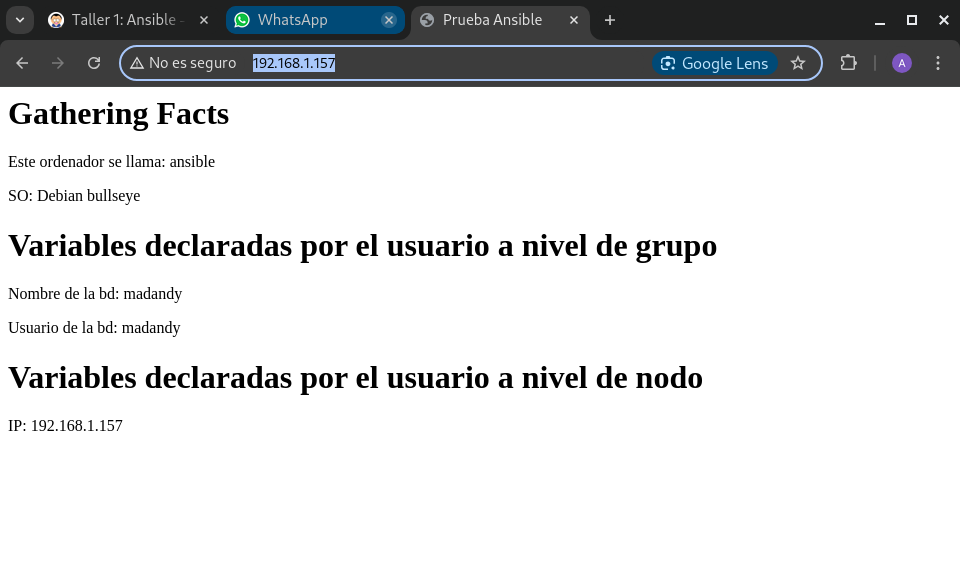

# Taller 1: Ansible - Playbook sencillo

## 1.Realiza la instalación de ansible. Puedes usar los repositorios oficiales de Debian, o realizar una instalación con pip en un entorno virtual python.

Instalación en un a máquina virtual *ansible*

```
apt install ansible -y
```
```
andy@ASO:~$ sudo apt install ansible -y
[sudo] contraseña para andy: 
Leyendo lista de paquetes... Hecho
Creando árbol de dependencias... Hecho
Leyendo la información de estado... Hecho
Se instalarán los siguientes paquetes adicionales:
  ansible-core ieee-data libyaml-0-2 python-babel-localedata python3-anyio
  python3-argcomplete python3-babel python3-cffi-backend python3-click
  python3-colorama python3-cryptography python3-distutils python3-dnspython
  python3-h11 python3-h2 python3-hpack python3-httpcore python3-httpx
  python3-hyperframe python3-jinja2 python3-jmespath python3-kerberos
  python3-lib2to3 python3-libcloud python3-lockfile python3-markdown-it
  python3-markupsafe python3-mdurl python3-netaddr python3-ntlm-auth
  python3-packaging python3-passlib python3-pygments python3-requests-kerberos
  python3-requests-ntlm python3-requests-toolbelt python3-resolvelib
  python3-rfc3986 python3-rich python3-selinux python3-simplejson
  python3-sniffio python3-tz python3-winrm pytho
```

Verificación de la versión:

```ansible --version ```

```
madandy@toyota-hilux:~$ ansible --version
ansible [core 2.14.16]
  config file = None
  configured module search path = ['/home/madandy/.ansible/plugins/modules', '/usr/share/ansible/plugins/modules']
  ansible python module location = /usr/lib/python3/dist-packages/ansible
  ansible collection location = /home/madandy/.ansible/collections:/usr/share/ansible/collections
  executable location = /usr/bin/ansible
  python version = 3.11.2 (main, Aug 26 2024, 07:20:54) [GCC 12.2.0] (/usr/bin/python3)
  jinja version = 3.1.2
  libyaml = True
madandy@toyota-hilux:~$ 


```

## 2.Crea una máquina virtual o contenedor LXC que vamos a configurar con ansible. Esta máquina debe tener las siguientes características:


Vamos a crear un contenedor:

```

madandy@toyota-hilux:~$ sudo lxc-create -n ansible -t debian -- -r bullseye


```
Verificación de que se ha creado:

```
madandy@toyota-hilux:~$ sudo lxc-ls -f
NAME         STATE   AUTOSTART GROUPS IPV4                 IPV6 UNPRIVILEGED 
ansible      STOPPED 0         -      -                    -    false        
servidorDHCP RUNNING 1         -      10.0.0.2, 172.16.0.2 -    false        
servidorWeb  RUNNING 1         -      10.0.128.104         -    false      

```

Habilitamos para que se inicie automaticamente:

```
madandy@toyota-hilux:~$ sudo lxc-autostart ansible

```


Iniciamos el contenedor:

```
madandy@toyota-hilux:~$ sudo lxc-start ansible 
lxc-start: ansible: ../src/lxc/tools/lxc_start.c: main: 256 Container is already running

```

Entramos en el contenedor 
```
madandy@toyota-hilux:~$ sudo lxc-attach -n ansible
root@ansible:/# 

```
Instalamos sudo (no vendra por defecto)

```
root@ansible:/# apt-get install sudo
Leyendo lista de paquetes... Hecho
Creando árbol de dependencias... Hecho
Se instalarán los siguientes paquetes NUEVOS:
  sudo
0 actualizados, 1 nuevos se instalarán, 0 para eliminar y 0 no actualizados.
Se necesita descargar 1.061 kB de archivos.
Se utilizarán 4.699 kB de espacio de disco adicional después de esta operación.
Des:1 http://deb.debian.org/debian bullseye/main amd64 sudo amd64 1.9.5p2-3+deb11u1 [1.061 kB]
Descargados 1.061 kB en 0s (2.441 kB/s)
debconf: delaying package configuration, since apt-utils is not installed
Seleccionando el paquete sudo previamente no seleccionado.
(Leyendo la base de datos ... 9410 ficheros o directorios instalados actualmente.)
Preparando para desempaquetar .../sudo_1.9.5p2-3+deb11u1_amd64.deb ...
Desempaquetando sudo (1.9.5p2-3+deb11u1) ...
Configurando sudo (1.9.5p2-3+deb11u1) ...
root@ansible:/# 

```
Creamos un usuario con contraseña usuario

```
root@ansible:/# adduser usuario
Adding user `usuario' ...
Adding new group `usuario' (1000) ...
Adding new user `usuario' (1000) with group `usuario' ...
Creating home directory `/home/usuario' ...
Copying files from `/etc/skel' ...
Nueva contraseña: 
Vuelva a escribir la nueva contraseña: 
passwd: contraseña actualizada correctamente
Cambiando la información de usuario para usuario
Introduzca el nuevo valor, o pulse INTRO para usar el valor predeterminado
	Nombre completo []: 
	Número de habitación []: 
	Teléfono del trabajo []: 
	Teléfono de casa []: 
	Otro []: 
Is the information correct? [Y/n] Y
root@ansible:/# 

```

Tenemos que meternos en el fichero */etc/sudoers* para etso tendremos que instalar *nano*:

```
root@ansible:/# apt-get install nano
```
Entrar en el fichero :

```
root@ansible:/# nano /etc/sudoers

```

Y poner las siguientes lineas:

```
# User privilege specification
root    ALL=(ALL:ALL) ALL
usuario ALL=(ALL) NOPASSWD:ALL
```

Ahora entraremos en el usuario creado:

```
root@ansible:/# su - usuario
usuario@ansible:~$ 

```

Crearemos el directorio ssh y le daremos permiso:

```
usuario@ansible:~$ sudo mkdir -p /home/usuario/.ssh
usuario@ansible:~$ sudo chmod 700 /home/usuario/.ssh/
usuario@ansible:~$ 

```

Vamos a tener que cambiar ede propietario de usuario:

```
usuario@ansible:~$ sudo chown -R usuario:usuario /home/usuario/.ssh
usuario@ansible:~$ ls -ld /home/usuario/.ssh
drwx------ 2 usuario usuario 6 oct 23 09:26 /home/usuario/.ssh
usuario@ansible:~$ 

```

Ahora dentro de authorized_keys copiamos las claves publicas:

```
usuario@ansible:~$ cd .ssh/
usuario@ansible:~/.ssh$ ls
usuario@ansible:~/.ssh$ sudo nano authorized_keys
usuario@ansible:~/.ssh$ 

```
Le damos permiso:

```usuario@ansible:~/.ssh$ sudo chmod 600 /home/usuario/.ssh/authorized_keys```
entramso en :

```
usuario@ansible:~$ sudo nano /etc/ssh/sshd_config

```
y en ese fichero ponemos esto:

```
# Authentication:

#LoginGraceTime 2m
PermitRootLogin no               
#StrictModes yes
#MaxAuthTries 6
#MaxSessions 10

PubkeyAuthentication yes

# Expect .ssh/authorized_keys2 to be disregarded by default in future.
AuthorizedKeysFile      .ssh/authorized_keys  
....
....
....
# To disable tunneled clear text passwords, change to no here!
PasswordAuthentication no 
#PermitEmptyPasswords no


```

Reiniciamos el servicio:

```
usuario@ansible:~$ sudo systemctl restart ssh

```
Y si nos damos cuenta, root es el propietario de los directoroios:

```
usuario@ansible:~$ ls -l /home/usuario/.ssh/
total 4
-rw------- 1 root root 574 oct 23 09:31 authorized_keys

usuario@ansible:~$ ls -l /home/usuario/.ssh/authorized_keys 
-rw------- 1 root root 574 oct 23 09:31 /home/usuario/.ssh/authorized_keys

```

Por lo que cambiamos de propietario:

```
usuario@ansible:~$ sudo chown usuario:usuario /home/usuario/.ssh/
usuario@ansible:~$ sudo chown usuario:usuario /home/usuario/.ssh/authorized_keys
usuario@ansible:~$ 
```

y ahora si somos propietarios y podemos conectarnos:

```
usuario@ansible:~$ ls -l /home/usuario/.ssh/authorized_keys 
-rw------- 1 usuario usuario 574 oct 23 09:31 /home/usuario/.ssh/authorized_keys
usuario@ansible:~$ ls -l /home/usuario/.ssh/
total 4
-rw------- 1 usuario usuario 574 oct 23 09:31 authorized_keys
usuario@ansible:~$ 

```

Ahora nos conectamos:

```
madandy@toyota-hilux:~$ ssh usuario@10.0.3.243
The authenticity of host '10.0.3.243 (10.0.3.243)' can't be established.
ED25519 key fingerprint is SHA256:0u6xxFLWG3TOPSQkfYEAMDF8QMqRQ6DV+Bc/mmb/3us.
This key is not known by any other names.
Are you sure you want to continue connecting (yes/no/[fingerprint])? yes
Warning: Permanently added '10.0.3.243' (ED25519) to the list of known hosts.
Linux ansible 6.1.0-26-amd64 #1 SMP PREEMPT_DYNAMIC Debian 6.1.112-1 (2024-09-30) x86_64

The programs included with the Debian GNU/Linux system are free software;
the exact distribution terms for each program are described in the
individual files in /usr/share/doc/*/copyright.

Debian GNU/Linux comes with ABSOLUTELY NO WARRANTY, to the extent
permitted by applicable law.
usuario@ansible:~$ 

```

## 3.Haz un fork del repositorio taller_ansible_vagrant y realiza una clonación en el ordenador donde has instalado ansible. Vamos a trabajar en el directorio Taller1.

```
madandy@toyota-hilux:~$ cd Documentos/SegundoASIR/github/
madandy@toyota-hilux:~/Documentos/SegundoASIR/github$ git clone git@github.com:madand1/taller_ansible_vagrant.git
Clonando en 'taller_ansible_vagrant'...
remote: Enumerating objects: 190, done.
remote: Counting objects: 100% (31/31), done.
remote: Compressing objects: 100% (17/17), done.
remote: Total 190 (delta 17), reused 14 (delta 14), pack-reused 159 (from 1)
Recibiendo objetos: 100% (190/190), 33.88 KiB | 369.00 KiB/s, listo.
Resolviendo deltas: 100% (56/56), listo.
madandy@toyota-hilux:~/Documentos/SegundoASIR/github$ 

```
Y como podemos comprobar lo tenemos aqui:

```
madandy@toyota-hilux:~/Documentos/SegundoASIR/github$ ls
ASO  iweb  prueba1_iaw  Servicios  taller_ansible_vagrant


```

## 4.    4. El inventario es el fichero donde definimos los equipos que vamos a configurar. En nuestro caso se llama hosts. En el inventario se clasifican los equipos por grupos:

Lo primero que haremos sera añadir una nueva interfaz conectada a br0.

Esta en el fichero: 

</var/lib/lxc/<nombre_del_contenedor>/config
>

```

lxc.net.1.type = veth
lxc.net.1.hwaddr = 00:16:3e:80:6f:8d
lxc.net.1.link = br0
lxc.net.1.flags = up
                      
```

Ahora reiniciamos el contenedor;

```
madandy@toyota-hilux:~$  sudo lxc-stop -n ansible
madandy@toyota-hilux:~$ sudo lxc-start -n ansible
madandy@toyota-hilux:~$ sudo lxc-attach -n ansible
```

Una vbez hecho esto lo que tenemos que hacer es entrar en el archivo de configuración */etc/netwrk/interfaces*

```
auto eth1
iface eth1 inet dhcp
```
y cuando salimos metemos este comando:

```ifup eth1```

y esto una vez levantada:

```
root@ansible:/# ip a
1: lo: <LOOPBACK,UP,LOWER_UP> mtu 65536 qdisc noqueue state UNKNOWN group default qlen 1000
    link/loopback 00:00:00:00:00:00 brd 00:00:00:00:00:00
    inet 127.0.0.1/8 scope host lo
       valid_lft forever preferred_lft forever
    inet6 ::1/128 scope host 
       valid_lft forever preferred_lft forever
2: eth0@if19: <BROADCAST,MULTICAST,UP,LOWER_UP> mtu 1500 qdisc noqueue state UP group default qlen 1000
    link/ether 00:16:3e:80:6f:8c brd ff:ff:ff:ff:ff:ff link-netnsid 0
    inet 10.0.3.243/24 brd 10.0.3.255 scope global dynamic eth0
       valid_lft 3400sec preferred_lft 3400sec
    inet6 fe80::216:3eff:fe80:6f8c/64 scope link 
       valid_lft forever preferred_lft forever
3: eth1@if20: <BROADCAST,MULTICAST,UP,LOWER_UP> mtu 1500 qdisc noqueue state UP group default qlen 1000
    link/ether 00:16:3e:80:6f:8d brd ff:ff:ff:ff:ff:ff link-netnsid 0
    inet 192.168.1.157/24 brd 172.22.255.255 scope global dynamic eth1
       valid_lft 86399sec preferred_lft 86399sec
    inet6 fe80::216:3eff:fe80:6f8d/64 scope link 
       valid_lft forever preferred_lft forever


```

Ahora nos dirigiremos al fichero *hosts* dentro del Taller1

```
madandy@toyota-hilux:~/Documentos/SegundoASIR/github/taller_ansible_vagrant/Taller1$ 
madandy@toyota-hilux:~/Documentos/SegundoASIR/github/taller_ansible_vagrant/Taller1$ sudo nano hosts

y pondremos lo siguiente;

madandy@toyota-hilux:~/Documentos/SegundoASIR/github/taller_ansible_vagrant/Taller1$ cat hosts 
all:
  children:
    servidores:
      hosts:
        ansible: 
          ansible_ssh_host: 192.168.1.157 
          ansible_ssh_user:  usuario
          ansible_ssh_private_key_file: /home/madandy/.ssh/id_rsa #Es la mia propia 
    


```

## 5.El fichero de configuración lo encontramos en el fichero ansible.cfg, donde tienes que poner el nombre del fichero de inventario en el parámetro inventory. El parámetro host_key_checking = False impide que se haga la comprobación del equipo cada vez que se hace la conexión ssh.

```
madandy@toyota-hilux:~/Documentos/SegundoASIR/github/taller_ansible_vagrant/Taller1$ sudo nano ansible.cfg 
madandy@toyota-hilux:~/Documentos/SegundoASIR/github/taller_ansible_vagrant/Taller1$ cat ansible.cfg 
[defaults]
inventory = /home/madandy/Documentos/SegundoASIR/github/taller_ansible_vagrant/Taller1/hosts

host_key_checking = False

```

## 6.Vamos a comprobar si tenemos conectividad con el nodo. Para ello vamos a usar el módulo ping de ansible. Ejecuta alguna de estas instrucciones:

Instalaremso python3 :

```
usuario@ansible:~$ sudo apt install python3 -y

```

Y hacemos las comprobación desde el hosts:

```
madandy@toyota-hilux:~/Documentos/SegundoASIR/github/taller_ansible_vagrant/Taller1$ ansible -m ping all
nodo1 | SUCCESS => {
    "ansible_facts": {
        "discovered_interpreter_python": "/usr/bin/python3"
    },
    "changed": false,
    "ping": "pong"
}
madandy@toyota-hilux:~/Documentos/SegundoASIR/github/taller_ansible_vagrant/Taller1$ 

madandy@toyota-hilux:~/Documentos/SegundoASIR/github/taller_ansible_vagrant/Taller1$ ansible -m ping servidores
nodo1 | SUCCESS => {
    "ansible_facts": {
        "discovered_interpreter_python": "/usr/bin/python3"
    },
    "changed": false,
    "ping": "pong"
}


madandy@toyota-hilux:~/Documentos/SegundoASIR/github/taller_ansible_vagrant/Taller1$ ansible -m ping ansible
ansible | SUCCESS => {
    "ansible_facts": {
        "discovered_interpreter_python": "/usr/bin/python3"
    },
    "changed": false,
    "ping": "pong"
}

```

## 7.

1. Variables a Nivel de Nodo (ansibble en mi caso)
Estas variables se definen en tu archivo de inventario y son específicas para cada nodo. En tu caso, has utilizado variables como ansible_ssh_host, ansible_ssh_user, etc. Puedes agregar más variables según sea necesario.
Por ejemplo, tu archivo hosts podría verse así:
yaml
Copiar código
all:
  children:
    servidores:
      hosts:
        ansible:
          ansible_ssh_host: 192.168.1.157
          ansible_ssh_user: usuario
          ansible_ssh_private_key_file: /home/madandy/.ssh/id_rsa
          bd_name: madand1
          bd_user: madandy
          bd_pass: madandy
2. Variables a Nivel de Grupo
Para definir variables que son comunes a un grupo de nodos, puedes crear un directorio llamado group_vars. Dentro de este directorio, puedes crear archivos YAML que contengan las variables que deseas aplicar a todos los nodos de ese grupo.
Pasos para Definir Variables a Nivel de Grupo:
    1. Crear el directorio group_vars dentro del directorio de tu proyecto.
       bash
       Copiar código
       mkdir -p ~/Documentos/SegundoASIR/github/taller_ansible_vagrant/Taller1/group_vars
    2. Crear un archivo para tus variables de grupo. Por ejemplo, un archivo llamado all.yml que contenga las variables para todos los nodos:
       yaml
       
       # ~/Documentos/SegundoASIR/github/taller_ansible_vagrant/Taller1/group_vars/all.yml
       bd_name: my_database
       bd_user: my_user
       bd_pass: my_password
1. Gathering Facts
Ansible puede recopilar información sobre los nodos a través de la recolección de "facts". Cuando ejecutas un playbook, Ansible recoge automáticamente información del nodo, como el hostname, la distribución del sistema operativo, la versión de Python, etc. Puedes ver esta información utilizando el módulo setup.
Ejemplo de Cómo Ver Facts de un Nodo:
Ejecuta el siguiente comando para recopilar y ver información sobre un nodo específico:
bash
Copiar código
```ansible ansible -m setup```
Esto mostrará una gran cantidad de información sobre el nodo, y puedes usar cualquiera de estos facts en tus playbooks y tareas. Por ejemplo:
yaml

```
madandy@toyota-hilux:~/Documentos/SegundoASIR/github/taller_ansible_vagrant/Taller1$ ansible ansible -m setup
ansible | SUCCESS => {
    "ansible_facts": {
        "ansible_all_ipv4_addresses": [
            "10.0.3.243",
            "192.168.1.157"
        ],
        "ansible_all_ipv6_addresses": [
            "fe80::216:3eff:fe80:6f8c",
            "2a0c:5a85:a307:8f00:216:3eff:fe80:6f8d",
            "fe80::216:3eff:fe80:6f8d"
        ],
        "ansible_apparmor": {
            "status": "disabled"
....
...
```
## 8.

```
madandy@toyota-hilux:~/Documentos/SegundoASIR/github/taller_ansible_vagrant/Taller1$ cat site.yaml 
- hosts: all
  become: true
  tasks:
      # Actualizamos paquetes
    - name: Actualizamos el sistema
      apt: update_cache=yes upgrade=yes
      # Instalar paquetes
    - name: "Instalar paquetes con apt"
      apt: # Aquí tienes que poner lo necesario para instalar git y apache2
      # Copia un fichero a la máquina remota
    - name: "Copiar fichero a la máquina remota"
      copy:
        src: files/foo.conf
        dest: 
        owner: root
        group: root
        mode: '0644'

      # Copia un template a un fichero
    - name: "Copiar un tamplate a un fichero de la máquina remota"
      template: 
        src: template/index.j2
        dest: 
        owner: www-data
        group: www-data
        mode: 0644


```

Ahora modificamos las variables del Gathering Facts:

```
- hosts: all
  become: true
  tasks:
    # Actualizamos paquetes
    - name: Actualizamos el sistema
      apt: 
        update_cache: yes
        upgrade: yes

    # Instalar paquetes
    - name: "Instalar paquetes con apt"
      apt: 
        name: 
          - git
          - apache2
        state: present  # Asegura que el paquete esté instalado

    # Copia un fichero a la máquina remota
    - name: "Copiar fichero a la máquina remota"
      copy:
        src: files/foo.conf
        dest: /etc/foo.conf  # Aquí debes poner la ruta de destino correcta
        owner: root
        group: root
        mode: '0644'

    # Copia un template a un fichero
    - name: "Copiar un template a un fichero de la máquina remota"
      template: 
        src: template/index.j2
        dest: /var/www/html/index.html  # Aquí debes poner la ruta de destino correcta
        owner: www-data
        group: www-data
        mode: '0644'

```
Por ultimo modifico el fichero template/index.j2

```
<html lang="es">
<head>
  <meta charset="utf-8">
  <title>Prueba Ansible</title>
</head>

<body>
  <h1>Gathering Facts</h1>
  <p>Este ordenador se llama: {{ ansible_hostname }}</p>
  <p>SO: {{ansible_distribution}} {{ansible_distribution_release}} </p>
  <h1>Variables declaradas por el usuario a nivel de grupo</h1>
  <p>Nombre de la bd: {{bd_name}}</p>
  <p>Usuario de la bd: {{bd_user}}</p>
  <h1>Variables declaradas por el usuario a nivel de nodo</h1>
  <p>IP: {{ansible_ssh_host}}</p>
</body>
</html>
```

y ejecutamos :

```
madandy@toyota-hilux:~/Documentos/SegundoASIR/github/taller_ansible_vagrant/Taller1$ ansible-playbook -i hosts site.yaml
 ____________
< PLAY [all] >
 ------------
        \   ^__^
         \  (oo)\_______
            (__)\       )\/\
                ||----w |
                ||     ||

 ________________________
< TASK [Gathering Facts] >
 ------------------------
        \   ^__^
         \  (oo)\_______
            (__)\       )\/\
                ||----w |
                ||     ||

ok: [ansible]
 ________________________________
< TASK [Actualizamos el sistema] >
 --------------------------------
        \   ^__^
         \  (oo)\_______
            (__)\       )\/\
                ||----w |
                ||     ||

ok: [ansible]
 __________________________________
< TASK [Instalar paquetes con apt] >
 ----------------------------------
        \   ^__^
         \  (oo)\_______
            (__)\       )\/\
                ||----w |
                ||     ||

ok: [ansible]
 ___________________________________________
< TASK [Copiar fichero a la máquina remota] >
 -------------------------------------------
        \   ^__^
         \  (oo)\_______
            (__)\       )\/\
                ||----w |
                ||     ||

ok: [ansible]
 _____________________________________________________________
< TASK [Copiar un template a un fichero de la máquina remota] >
 -------------------------------------------------------------
        \   ^__^
         \  (oo)\_______
            (__)\       )\/\
                ||----w |
                ||     ||

changed: [ansible]
 ____________
< PLAY RECAP >
 ------------
        \   ^__^
         \  (oo)\_______
            (__)\       )\/\
                ||----w |
                ||     ||

ansible                    : ok=5    changed=1    unreachable=0    failed=0    skipped=0    rescued=0    ignored=0   

```
- ¿Se ejecutan todas las tareas al modificar el archivo foo.txt y ejecutar nuevamente la receta?

No, Ansible lo que hace es que las tareas que ya han sido ejecutadas, nos la vuelve a ejecutar. Pero si hacemos algún cambio (por ejemplo, la modificación del archivo foo.txt), esa tarea si se volverá a ejecutar.

- ¿Cómo se llama la propiedad que permite que las tareas que ya se han realizado no se vuelvan a ejecutar?
La propiedad se llama idempotencia, esto significa que, las tareas solo se ejecutan si algo ha cambiado.


## 9.
Lo qu ehe hecho he ido al foo.conf y he puesto la siguiente frase:
```Prueba pruebita de Ansible, baby```

Luego de eso lo que he hecho ha sido esto:

```
madandy@toyota-hilux:~/Documentos/SegundoASIR/github/taller_ansible_vagrant/Taller1/files$ nano foo.conf 
madandy@toyota-hilux:~/Documentos/SegundoASIR/github/taller_ansible_vagrant/Taller1/files$ ansible-playbook -i hosts site.yaml
ERROR! the playbook: site.yaml could not be found
madandy@toyota-hilux:~/Documentos/SegundoASIR/github/taller_ansible_vagrant/Taller1/files$ cd ..
madandy@toyota-hilux:~/Documentos/SegundoASIR/github/taller_ansible_vagrant/Taller1$ ansible-playbook -i hosts site.yaml
 ____________
< PLAY [all] >
 ------------
        \   ^__^
         \  (oo)\_______
            (__)\       )\/\
                ||----w |
                ||     ||

 ________________________
< TASK [Gathering Facts] >
 ------------------------
        \   ^__^
         \  (oo)\_______
            (__)\       )\/\
                ||----w |
                ||     ||

ok: [ansible]
 ________________________________
< TASK [Actualizamos el sistema] >
 --------------------------------
        \   ^__^
         \  (oo)\_______
            (__)\       )\/\
                ||----w |
                ||     ||

ok: [ansible]
 __________________________________
< TASK [Instalar paquetes con apt] >
 ----------------------------------
        \   ^__^
         \  (oo)\_______
            (__)\       )\/\
                ||----w |
                ||     ||

ok: [ansible]
 ___________________________________________
< TASK [Copiar fichero a la máquina remota] >
 -------------------------------------------
        \   ^__^
         \  (oo)\_______
            (__)\       )\/\
                ||----w |
                ||     ||

changed: [ansible]
 _____________________________________________________________
< TASK [Copiar un template a un fichero de la máquina remota] >
 -------------------------------------------------------------
        \   ^__^
         \  (oo)\_______
            (__)\       )\/\
                ||----w |
                ||     ||

ok: [ansible]
 ____________
< PLAY RECAP >
 ------------
        \   ^__^
         \  (oo)\_______
            (__)\       )\/\
                ||----w |
                ||     ||

ansible                    : ok=5    changed=1    unreachable=0    failed=0    skipped=0    rescued=0    ignored=0   

```
Por ultimo lo que hago es irme al contenedor y ver con un cat si se ha cambiado:

```

usuario@ansible:~$ cat /etc/f
foo.conf  fstab     
usuario@ansible:~$ cat /etc/foo.conf 
Prueba pruebita de Ansible, baby
usuario@ansible:~$ ^C
usuario@ansible:~$ 

```
Como vemos se ha cambiado.

Y ahora comprobamos que el index nos da la info de :

```http://192.168.1.157```



¿Se ejecutan todas las tareas al modificar el archivo foo.txt y ejecutar nuevamente la receta?

No, Ansible lo que hace es que las tareas que ya han sido ejecutadas, nos la vuelve a ejecutar. Pero si hacemos algún cambio (por ejemplo, la modificación del archivo foo.txt), esa tarea si se volverá a ejecutar.

¿Cómo se llama la propiedad que permite que las tareas que ya se han realizado no se vuelvan a ejecutar?
La propiedad se llama idempotencia, esto significa que, las tareas solo se ejecutan si algo ha cambiado.

Ubir a github:

```
madandy@toyota-hilux:~/Documentos/SegundoASIR/github/taller_ansible_vagrant/Taller1$ git add .
madandy@toyota-hilux:~/Documentos/SegundoASIR/github/taller_ansible_vagrant/Taller1$ git commit -m "ralle1 hecho"
[main 9c01b9e] ralle1 hecho
 4 files changed, 9 insertions(+), 8 deletions(-)
madandy@toyota-hilux:~/Documentos/SegundoASIR/github/taller_ansible_vagrant/Taller1$ git push origin main
Enumerando objetos: 17, listo.
Contando objetos: 100% (17/17), listo.
Compresión delta usando hasta 20 hilos
Comprimiendo objetos: 100% (7/7), listo.
Escribiendo objetos: 100% (9/9), 867 bytes | 867.00 KiB/s, listo.
Total 9 (delta 3), reusados 0 (delta 0), pack-reusados 0
remote: Resolving deltas: 100% (3/3), completed with 3 local objects.
To github.com:madand1/taller_ansible_vagrant.git
   59b41a6..9c01b9e  main -> main

```