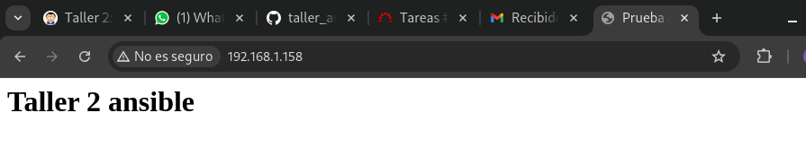
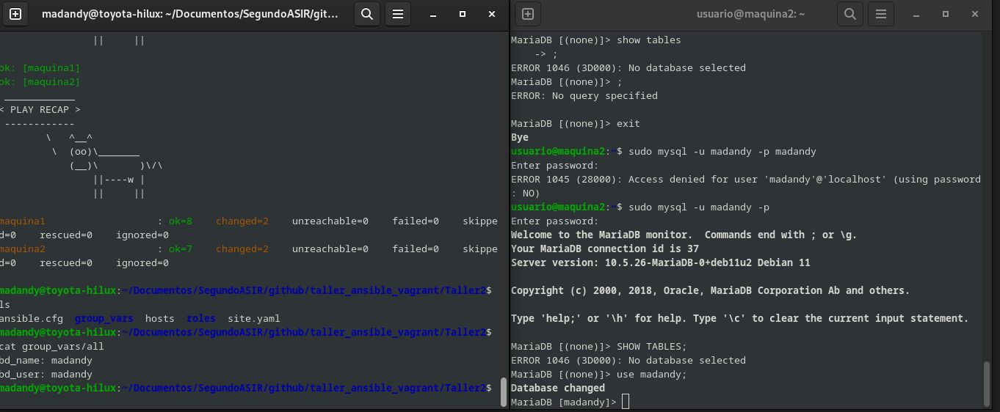

h2. 1.Entrega una captura de pantalla donde se vea que se ha finalizado la ejecución del playbook.

<pre>
madandy@toyota-hilux:~/Documentos/SegundoASIR/github/taller_ansible_vagrant/Taller2$ ansible-playbook site.yaml 
 _________________
< PLAY [maquina1] >
 -----------------
        \   ^__^
         \  (oo)\_______
            (__)\       )\/\
                ||----w |
                ||     ||

 ________________________
< TASK [Gathering Facts] >
 ------------------------
        \   ^__^
         \  (oo)\_______
            (__)\       )\/\
                ||----w |
                ||     ||

ok: [maquina1]
 ______________________________________________
< TASK [apache2 : ensure apache2 is installed] >
 ----------------------------------------------
        \   ^__^
         \  (oo)\_______
            (__)\       )\/\
                ||----w |
                ||     ||

ok: [maquina1]
 ______________________________________
< TASK [apache2 : copy template index] >
 --------------------------------------
        \   ^__^
         \  (oo)\_______
            (__)\       )\/\
                ||----w |
                ||     ||

changed: [maquina1]
 ____________________________________________________
< TASK [apache2 : Copiar fichero al servidor remoto] >
 ----------------------------------------------------
        \   ^__^
         \  (oo)\_______
            (__)\       )\/\
                ||----w |
                ||     ||

changed: [maquina1]
 _____________________________________________________________
/ TASK [apache2 : Copiar fichero de configuración y reiniciar \
\ el servicio]                                                /
 -------------------------------------------------------------
        \   ^__^
         \  (oo)\_______
            (__)\       )\/\
                ||----w |
                ||     ||

changed: [maquina1]
 _______________________________________________________
/ TASK [apache2 : Copiar un tamplate a un fichero de la \
\ máquina remota]                                       /
 -------------------------------------------------------
        \   ^__^
         \  (oo)\_______
            (__)\       )\/\
                ||----w |
                ||     ||

changed: [maquina1]
 _____________________________________________
< RUNNING HANDLER [apache2 : restart apache2] >
 ---------------------------------------------
        \   ^__^
         \  (oo)\_______
            (__)\       )\/\
                ||----w |
                ||     ||

changed: [maquina1]
 _________________
< PLAY [maquina2] >
 -----------------
        \   ^__^
         \  (oo)\_______
            (__)\       )\/\
                ||----w |
                ||     ||

 ________________________
< TASK [Gathering Facts] >
 ------------------------
        \   ^__^
         \  (oo)\_______
            (__)\       )\/\
                ||----w |
                ||     ||

ok: [maquina2]
 ______________________________________________
< TASK [mariadb : ensure mariadb is installed] >
 ----------------------------------------------
        \   ^__^
         \  (oo)\_______
            (__)\       )\/\
                ||----w |
                ||     ||

changed: [maquina2]
 ____________________________________________
< TASK [mariadb : create database wordpress] >
 --------------------------------------------
        \   ^__^
         \  (oo)\_______
            (__)\       )\/\
                ||----w |
                ||     ||

changed: [maquina2]
 ______________________________________________
< TASK [mariadb : create user mysql wordpress] >
 ----------------------------------------------
        \   ^__^
         \  (oo)\_______
            (__)\       )\/\
                ||----w |
                ||     ||

changed: [maquina2] => (item=localhost)
 ___________________________________________________
< TASK [mariadb : mariadb listen in all interfaces] >
 ---------------------------------------------------
        \   ^__^
         \  (oo)\_______
            (__)\       )\/\
                ||----w |
                ||     ||

changed: [maquina2]
 _____________________________________________
< RUNNING HANDLER [mariadb : restart mariadb] >
 ---------------------------------------------
        \   ^__^
         \  (oo)\_______
            (__)\       )\/\
                ||----w |
                ||     ||

changed: [maquina2]
 ____________
< PLAY [all] >
 ------------
        \   ^__^
         \  (oo)\_______
            (__)\       )\/\
                ||----w |
                ||     ||

 ________________________
< TASK [Gathering Facts] >
 ------------------------
        \   ^__^
         \  (oo)\_______
            (__)\       )\/\
                ||----w |
                ||     ||

ok: [maquina2]
ok: [maquina1]
 __________________________________________
< TASK [commons : Actualizamos el sistema] >
 ------------------------------------------
        \   ^__^
         \  (oo)\_______
            (__)\       )\/\
                ||----w |
                ||     ||

changed: [maquina2]
changed: [maquina1]
 ____________
< PLAY RECAP >
 ------------
        \   ^__^
         \  (oo)\_______
            (__)\       )\/\
                ||----w |
                ||     ||

maquina1                   : ok=9    changed=6    unreachable=0    failed=0    skipped=0    rescued=0    ignored=0   
maquina2                   : ok=8    changed=6    unreachable=0    failed=0    skipped=0    rescued=0    ignored=0   
</pre>

h2. 2.Captura de pantalla donde se vea el acceso desde el navegador al servidor web, y se vea el contenido del fichero index.html. 

h2. 3.Captura de pantalla donde se vea el acceso a la base de datos.

h2. 4.Realiza un cambio en la receta que necesite ejecutar el reinicio del servicio. Ejecuta de nuevo el playbook y comprueba que se ha ejecutado el handler correspondiente.

Cmabie el puerto de esucha de apache2:

<pre>
madandy@toyota-hilux:~/Documentos/SegundoASIR/github/taller_ansible_vagrant/Taller2$ ansible-playbook -i hosts site.yaml
 _________________
< PLAY [maquina1] >
 -----------------
        \   ^__^
         \  (oo)\_______
            (__)\       )\/\
                ||----w |
                ||     ||

 ________________________
< TASK [Gathering Facts] >
 ------------------------
        \   ^__^
         \  (oo)\_______
            (__)\       )\/\
                ||----w |
                ||     ||

ok: [maquina1]
 ______________________________________________
< TASK [apache2 : ensure apache2 is installed] >
 ----------------------------------------------
        \   ^__^
         \  (oo)\_______
            (__)\       )\/\
                ||----w |
                ||     ||

ok: [maquina1]
 ______________________________________
< TASK [apache2 : copy template index] >
 --------------------------------------
        \   ^__^
         \  (oo)\_______
            (__)\       )\/\
                ||----w |
                ||     ||

ok: [maquina1]
 ____________________________________________________
< TASK [apache2 : Copiar fichero al servidor remoto] >
 ----------------------------------------------------
        \   ^__^
         \  (oo)\_______
            (__)\       )\/\
                ||----w |
                ||     ||

ok: [maquina1]
 _____________________________________________________________
/ TASK [apache2 : Copiar fichero de configuración y reiniciar \
\ el servicio]                                                /
 -------------------------------------------------------------
        \   ^__^
         \  (oo)\_______
            (__)\       )\/\
                ||----w |
                ||     ||

ok: [maquina1]
 _________________
< PLAY [maquina2] >
 -----------------
        \   ^__^
         \  (oo)\_______
            (__)\       )\/\
                ||----w |
                ||     ||

 ________________________
< TASK [Gathering Facts] >
 ------------------------
        \   ^__^
         \  (oo)\_______
            (__)\       )\/\
                ||----w |
                ||     ||

ok: [maquina2]
 ______________________________________________
< TASK [mariadb : ensure mariadb is installed] >
 ----------------------------------------------
        \   ^__^
         \  (oo)\_______
            (__)\       )\/\
                ||----w |
                ||     ||

ok: [maquina2]
 ____________________________________________
< TASK [mariadb : create database wordpress] >
 --------------------------------------------
        \   ^__^
         \  (oo)\_______
            (__)\       )\/\
                ||----w |
                ||     ||

ok: [maquina2]
 ______________________________________________
< TASK [mariadb : create user mysql wordpress] >
 ----------------------------------------------
        \   ^__^
         \  (oo)\_______
            (__)\       )\/\
                ||----w |
                ||     ||

ok: [maquina2] => (item=localhost)
 ___________________________________________________
< TASK [mariadb : mariadb listen in all interfaces] >
 ---------------------------------------------------
        \   ^__^
         \  (oo)\_______
            (__)\       )\/\
                ||----w |
                ||     ||

ok: [maquina2]
 ____________
< PLAY [all] >
 ------------
        \   ^__^
         \  (oo)\_______
            (__)\       )\/\
                ||----w |
                ||     ||

 ________________________
< TASK [Gathering Facts] >
 ------------------------
        \   ^__^
         \  (oo)\_______
            (__)\       )\/\
                ||----w |
                ||     ||

ok: [maquina1]
ok: [maquina2]
 __________________________________________
< TASK [commons : Actualizamos el sistema] >
 ------------------------------------------
        \   ^__^
         \  (oo)\_______
            (__)\       )\/\
                ||----w |
                ||     ||

ok: [maquina1]
ok: [maquina2]
 ____________
< PLAY RECAP >
 ------------
        \   ^__^
         \  (oo)\_______
            (__)\       )\/\
                ||----w |
                ||     ||

maquina1                   : ok=7    changed=0    unreachable=0    failed=0    skipped=0    rescued=0    ignored=0   
maquina2                   : ok=7    changed=0    unreachable=0    failed=0    skipped=0    rescued=0    ignored=0   

</pre>

h2. Entrega la URL de tu repositorio con el que estás trabajando.

<pre>
https://github.com/madand1/taller_ansible_vagrant
</pre>