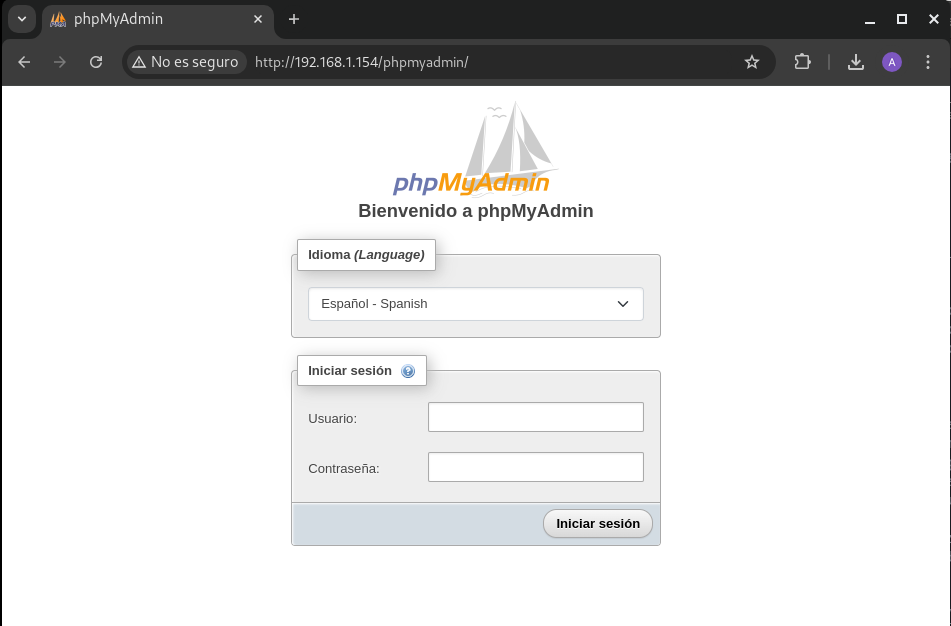
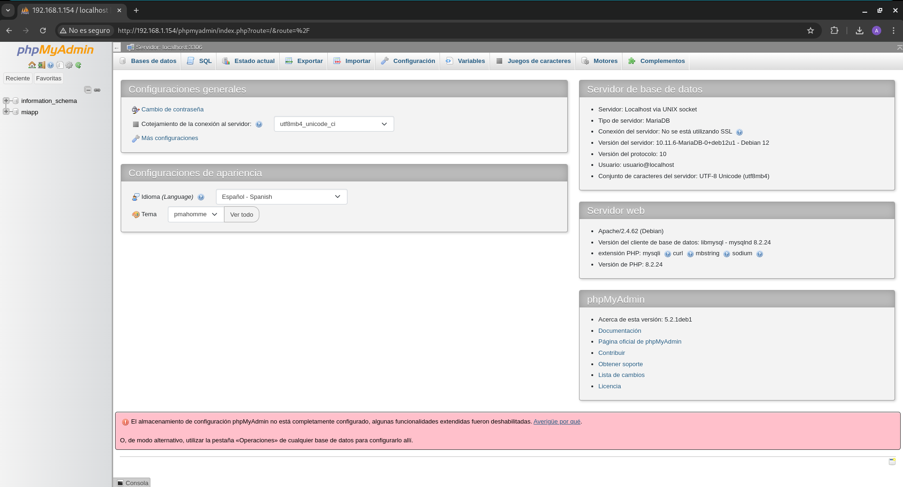
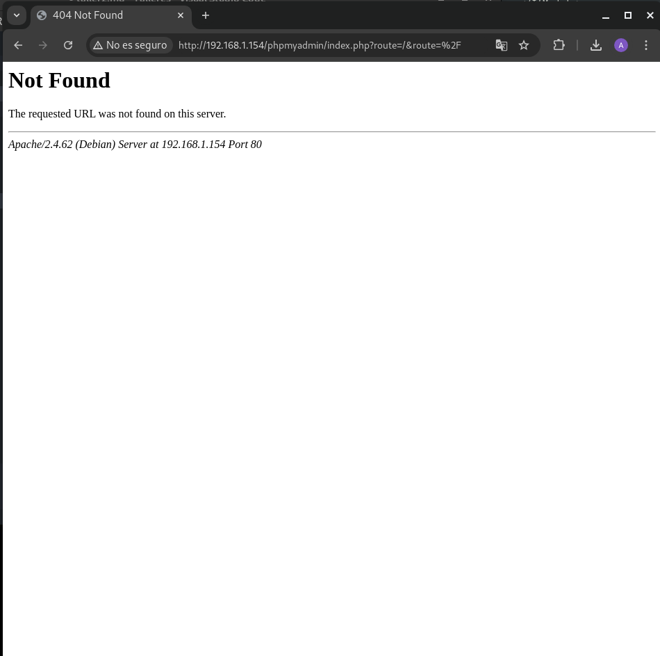
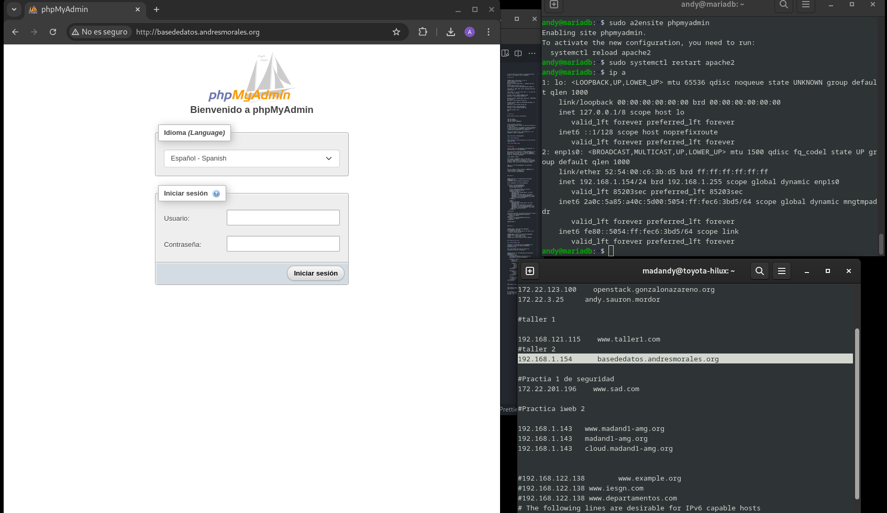
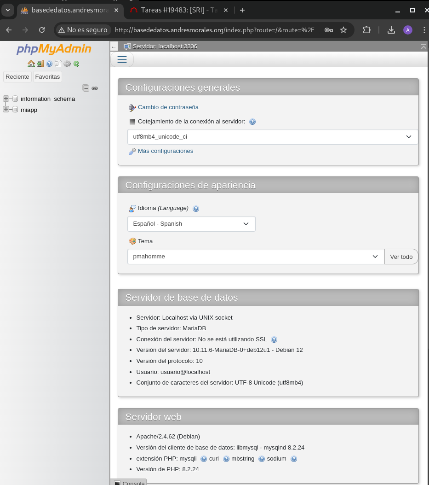

Lo que he hecho ha sido coger una maquina que tenia por ahi, y he codigo y hice lo siguiente:

# Ejercicio 1

```
andy@mariadb:~$ sudo mysql -u root -p
[sudo] contraseña para andy: 
Enter password: 
Welcome to the MariaDB monitor.  Commands end with ; or \g.
Your MariaDB connection id is 31
Server version: 10.11.6-MariaDB-0+deb12u1 Debian 12

Copyright (c) 2000, 2018, Oracle, MariaDB Corporation Ab and others.

Type 'help;' or '\h' for help. Type '\c' to clear the current input statement.

MariaDB [(none)]> CREATE DATABASE miapp;
Query OK, 1 row affected (0,000 sec)

MariaDB [(none)]> CREATE USER 'usuario'@'%' IDENTIFIED BY 'usuario';
Query OK, 0 rows affected (0,026 sec)

MariaDB [(none)]> GRANT ALL PRIVILEGES ON miapp.* TO 'usuario'@'%';
Query OK, 0 rows affected (0,027 sec)

MariaDB [(none)]> FLUSH PRIVILEGES;
Query OK, 0 rows affected (0,001 sec)

MariaDB [(none)]> exit;
Bye

```
# Ejercicio 2

Ahora instalo lo que es *phpmyadmin*:

```
sudo apt update
sudo apt upgrade -y
sudo apt install phpmyadmin
```

Varias opciones en Pantalla
1. Selecciona apache2 usando las teclas de dirección y presiona Enter
2. Elige No cuando se te pregunte si deseas configurar la base de datos para phpMyAdmin automáticamente. Lo configuraremos manualmente si es necesario.

Una vez que tenemos esto lo que haremos será ir al navegador y poner lo siguiente:

```
http://192.168.1.154/phpmyadmin/
```


Ahora entramos con usuario/usuario y se nos veria del siguiente modo:




# Ejercicio3

¿Se ha creado en el DocumentRoot (/var/www/html) un directorio que se llama phpmyadmin?

No, no se crea un directorio llamado phpmyadmin en el DocumentRoot (/var/www/html) al instalar phpMyAdmin desde los repositorios. Los archivos de phpMyAdmin se ubican en /usr/share/phpmyadmin.

¿Cómo podemos acceder?

Para acceder a phpMyAdmin desde la URL http://ip_servidor/phpmyadmin, es necesario crear un enlace simbólico desde /usr/share/phpmyadmin al DocumentRoot de Apache. Esto se hace con el siguiente comando:

```
sudo ln -s /usr/share/phpmyadmin /var/www/html/phpmyadmin
```
```
Una vez creado el enlace simbólico, phpMyAdmin será accesible desde el navegador en:
 http://192.168.1.154/phpmyadmin

```

Ejercicio 4:

```
ndy@mariadb:~$ cat /etc/apache2/conf-available/phpmyadmin.conf 
# phpMyAdmin default Apache configuration

Alias /phpmyadmin /usr/share/phpmyadmin

<Directory /usr/share/phpmyadmin>
    Options SymLinksIfOwnerMatch
    DirectoryIndex index.php

    # limit libapache2-mod-php to files and directories necessary by pma
    <IfModule mod_php7.c>
        php_admin_value upload_tmp_dir /var/lib/phpmyadmin/tmp
        php_admin_value open_basedir /usr/share/phpmyadmin/:/usr/share/doc/phpmyadmin/:/etc/phpmyadmin/:/var/lib/phpmyadmin/:/usr/share/php/:/usr/share/javascript/
    </IfModule>

    # PHP 8+
    <IfModule mod_php.c>
        php_admin_value upload_tmp_dir /var/lib/phpmyadmin/tmp
        php_admin_value open_basedir /usr/share/phpmyadmin/:/usr/share/doc/phpmyadmin/:/etc/phpmyadmin/:/var/lib/phpmyadmin/:/usr/share/php/:/usr/share/javascript/
    </IfModule>

</Directory>

# Disallow web access to directories that don't need it
<Directory /usr/share/phpmyadmin/templates>
    Require all denied
</Directory>
<Directory /usr/share/phpmyadmin/libraries>
    Require all denied
</Directory>

andy@mariadb:~$ 

```

Ejercicio 5

```
andy@mariadb:~$ sudo a2disconf phpmyadmin 
Conf phpmyadmin disabled.
To activate the new configuration, you need to run:
  systemctl reload apache2

andy@mariadb:~$ sudo rm /var/www/html/phpmyadmin
andy@mariadb:~$ sudo systemctl res
rescue        reset-failed  restart       
andy@mariadb:~$ sudo systemctl restart apache2

```
Por lo que se verá asi:



Configura un VirtualHost para que phpMyAdmin sea accesible a través del dominio basededatos.andresmorales.org.

Por lo que tendre que crear el archivo de configuración para el VirtualHost:

```
andy@mariadb:~$ cat /etc/apache2/sites-available/phpmyadmin.conf
<VirtualHost *:80>
    ServerName basededatos.andresmorales.org
    DocumentRoot /usr/share/phpmyadmin

    <Directory /usr/share/phpmyadmin>
        Options FollowSymLinks
        DirectoryIndex index.php

        <IfModule mod_php.c>
            php_admin_flag engine On
            php_admin_value upload_max_filesize 64M
            php_admin_value post_max_size 64M
        </IfModule>
    </Directory>

    <Directory /usr/share/phpmyadmin/setup>
        <IfModule mod_authz_core.c>
            Require local
        </IfModule>
    </Directory>

    <Directory /usr/share/phpmyadmin/libraries>
        Require all denied
    </Directory>
</VirtualHost>

```

Habilitamos el nuevo VirtualHost:

```
sudo a2ensite phpmyadmin
sudo systemctl restart apache2
```

En la maquina física ponemos el siguiente comando en el nano /etc/hosts
192.168.1.154	basededatos.andresmorales.org

Con lo que vamos a ver si nos funciona, y como podemos ver nos funciona:



Enrada con mi usuario/usuario


