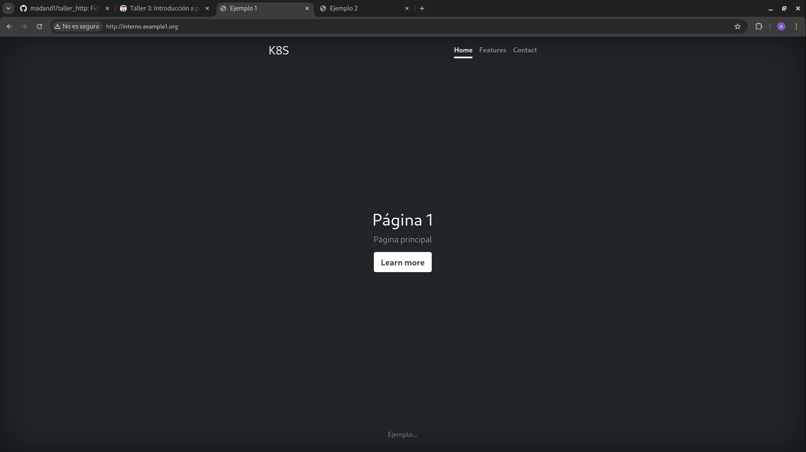
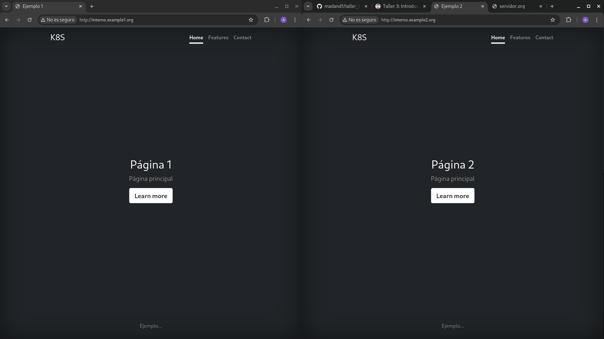
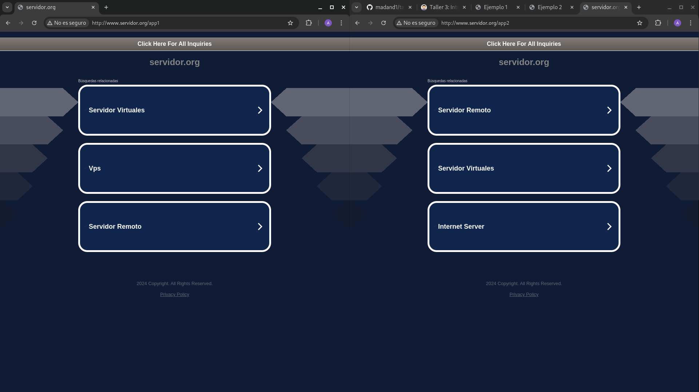
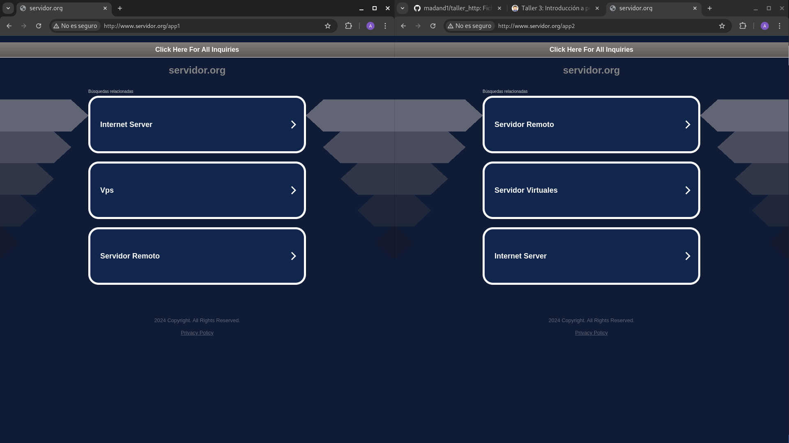

Lo primero que hemos hecho ha sido bajarnos por consola el repo que nos pide en el ejercicio:

```
git clone git@github.com:josedom24/taller_http.git
```

y ahora lo que haremos será lo siguiente, luego lo que hacemos es coger y hacer un vagrant up , de lo que sera el Vagrantfile, una vez entramos por el coamdno vagrant ssh servidorweb, y cogemos la ip, y la modificamos en el hosts de ansible.

He configruado los roles de la siguiente manera:

```
virtualhosts:
  - name: vhost1
    datos:
      nameserver: interno.example1.org
      documentroot: /var/www/example1
      errorlog: error_example1
      accesslog: access_example1 

  - name: vhost2
    datos:
      nameserver: interno.example2.org
      documentroot: /var/www/example2
      errorlog: error_example2
      accesslog: access_example2 

 

mods_enabled:
  - rewrite


```
Y como podemos ver cuando hacemos lo de ansible:




ahora vamos con lo siguiente:

3. Instala un servidor web apache2 en la máquina proxy. Vamos a configurar el proxy para acceder a las páginas del servidorweb: A la primera página con la URL www.app1.org y a la segunda página con la URL www.app2.org. Realiza la configuración para que las redirecciones funcionen: al acceder a http://www.app1.org/directorio se debe realizar una redirección al directorio nuevodirectorio.

lo primero que tendremos que hacer es:

```
sudo apt update
sudo apt install apache2 -y

```
y habilitar:

```
sudo a2enmod proxy proxy_http rewrite
sudo systemctl restart apache2

```
ahora crearemos el fichero proxy.conf en /etc/apache2/sites-availableproxy.conf

```
<VirtualHost *:80>
    ServerName www.app1.org
    ServerAlias www.app2.org

    ProxyPreserveHost On

    # Configuración del proxy
    ProxyPass / http://192.168.1.115/
    ProxyPassReverse / http://192.168.1.115/

    # Redirección de /directorio a /nuevodirectorio
    RewriteEngine On
    RewriteRule ^/directorio$ /nuevodirectorio [R=301,L]
</VirtualHost>

```

y habilitamos el sitio:

```
sudo a2ensite proxy.conf
sudo systemctl reload apache2


```
y se veria de la siguiente manera:



Ahora lo que tengo que hacer es modificar la configuracion del proxy para acceder a las paguinas web,con las siguientes URL: www.servidor.org/app1 y www.servidor.org/app2. Debe seguir funcionando las redirecciones.

para eso ponemos lo siguiente:

```
vagrant@proxy:~$ cat /etc/apache2/sites-available/proxy.conf 
<VirtualHost *:80>
    ServerName www.servidor.org

    ProxyPreserveHost On

    # Proxy para app1
    ProxyPass /app1 http://192.168.121.115/example1
    ProxyPassReverse /app1 http://192.168.121.115/example1

    # Proxy para app2
    ProxyPass /app2 http://192.168.121.115/example2
    ProxyPassReverse /app2 http://192.168.121.115/example2

    # Redirección de /directorio a /nuevodirectorio
    RewriteEngine On
    RewriteRule ^/app1/directorio$ /app1/nuevodirectorio [R=301,L]
    RewriteRule ^/app2/directorio$ /app2/nuevodirectorio [R=301,L]
</VirtualHost>

```



AHORA vamos a desinstalar apache e instalar NGNIX

```
sudo apt remove apache2 -y
sudo apt autoremove -y
sudo apt install nginx -y

```

y configuramos ngnix:


```
sudo nano /etc/nginx/sites-available/proxy

server {
    listen 80;
    server_name www.app1.org www.app2.org;

    location / {
        proxy_pass http://192.168.1.115;
        proxy_set_header Host $host;
        proxy_set_header X-Real-IP $remote_addr;
    }

    location /directorio {
        return 301 /nuevodirectorio;
    }
}

server {
    listen 80;
    server_name www.servidor.org;

    location /app1 {
        proxy_pass http://192.168.1.115/example1;
    }

    location /app2 {
        proxy_pass http://192.168.1.115/example2;
    }
}


```

Activar la configuración:

```
sudo ln -s /etc/nginx/sites-available/proxy /etc/nginx/sites-enabled/
sudo nginx -t
sudo systemctl reload nginx

```

Y como podemos ver:

