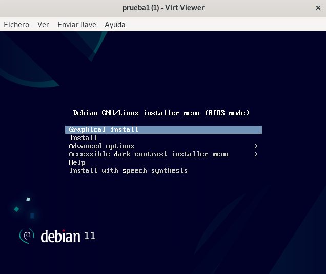

# Instalación de QEMU/KVM + libvirt 

Para trabajar con el sistema de virtualizacion QEMU/KVM + libvirt, debemos instalar los siguienetes paquetes:

'apt install qemu-system libvirt-clients libvirt-daemon-system'

# Conexión a QEMU/KVM

- Listar las máquinas que hemos creado

'virsh -c qemu:///system list --all

# Creación de máquinas virtulaes desde la línea de comandos

Para esto lo que se hace es usar el comando:
'virt-install'

## Estructura de creación de una máquina

```
virt-install --connect qemu:///system \
			 --virt-type kvm \
			 --name nombre_maquina \
			 --cdrom ruta_de_la_iso \
			 --os-variant debian11 \
			 --disk size=10 \
			 --memory 1024 \
			 --vcpus 1
```

Con esto se arranca lo que será la instalación de nuestra máquina creada.



# Pool de almacenamiento

- Ver los volumenes que hay 

virsh -c qemu:///system pool-list

- Veamos el volumen que se ha creado en el pool ( de manera normal se hara en **default**)

virsh -c qemu:///system vol-list default

- Crear un pool de almacenamiento

virsh pool-define-as [nombre_del_pool] dir --target [nombre_que_den]

- Crear el direccion indicado

virsh -c qemu:///system pool-build nombre_del_pool

- Iniciar y activar el pool de almacenamiento

virsh pool-start nombre_del_pool
virsh pool-autostart nombre_del_pool

- crear el volumen dentro del pool 

virsh vol-create-as mi_pool [nombre_del_volumen] [tamaño] --format qcow2

## Estructura usando un pool distinto 
- Para un volumen existente en el pool

```
virt-install --connect qemu:///system \
    				--virt-type kvm \
    				--name debian \
    				--cdrom ~/ISOS/debian-12.1.0-amd64-netinst.iso \
    				--disk vol=nombre_poolñ/volumen_que_queramos \
    				--os-variant debian11 \
				--memory 1024 \
    				--vcpus 1

```

- Crear un nuevo disco o volumen en el pool de almacenamiento

```
 virt-install --connect qemu:///system \
    --virt-type kvm \
    --name nombre_maquina \
    --cdrom ruta_de_la_iso \
    --disk pool=mi_pool,size=10,format=qcow2 \
    --os-variant debian11 \
    --memory 1024 \
    --vcpus 1
```

- Parar pool 
virsh -c qemu:///system pool-destroy nombre_maquina

- Borrar directorio 
virsh -c qemu:///system pool-delete nombre_maquina

- Eliminar

virsh -c qemu:///system pool-undefine nombre_maquina 

- Detalles del pool 

virsh -c qemu:///system pool-info nombre_pool

- Borrar un volumen 

virsh -c qemu:///system vol-delete <nombre-del-volumen> --pool <nombre-del-pool>

- Detener un pool

virsh -c qemu:///system pool-destroy <nombre-del-pool>

- Eliminar la definición del pool 

virsh -c qemu:///system pool-undefine <nombre-del-pool>

- Borrar archivos asociados al pool

virsh -c qemu:///system pool-undefine <nombre-del-pool>

- Refrescar pool 

virsh -c qemu:///system pool-refresh <nombre-del-pool>


# Gestión de las máquinas virtuales con virsh

En este apartado lo que hare sera poner los comandos de gestión de máquinas virtuales por comandos de terminal:

- Listar máquinas:
    virsh -c qemu:///system list --all

- Arrnacar maquina:

virsh -c qemu:///system start prueba1

- Poner el auto arranque, por si se usa demasiado:

virsh -c qemu:///system autostart prueba1

- Apagar de forma adecuada:

virsh -c qemu:///system shutdown prueba1

- Reiniciar la maquina 

virsh -c qemu:///system reboot prueba1

- Forzar el apagado

virsh -c qemu:///system destroy prueba1

- Pausar la ejecucion de la máquina

virsh -c qemu:///system suspend prueba1

- Continuar con la ejecución de la máquina

virsh -c qemu:///system resume prueba1

- Eliminar una maquina que este **PARADA** eliminando los volumenes

virsh -c qemu:///system undefine --remove-all-storage prueba1

## Obtener informacion de la máquina virtual

- Obtener información de la máquina

virsh -c qemu:///system dominfo prueba1 

- Obtener direccion IP de la interfaz de la red:

virsh -c qemu:///system domifaddr prueba1

- Obtener los discos que tiene la máquina

virsh -c qemu:///system domblklist prueba1

## Modificación la máquina 

- Modificar el nombre de una máquina virtual

virsh -c qemu:///system domrename nombre_viejo nombre_nuevo

Con esto lo que se hace es modificar el nombre de la máquina, pero no su dominio, es decir, no lo que no saldra una vez estemos por terminal: **root@linux-andy:~**

Si no que será el **NOMBRE** de dicha máquina.

# Clonación de máquinas

**De esta manera no se hara**

Hace una copia de la configuración XML de la maquina de origen y sus imagenes de disco, y realiza ajustes en las configuraciones para asegurar la unicidad de la nueva máquina.

Para esto usaremos el **VIRT-CLONE** con el siguiente comando:

virt-clone --connect=qemu:///system --original nombre_viejo --name nombre_nuevo --auto-clone

* --auto-clone este parametro nos dara lo siguiente **nueva direccion MAC** y **nueva ruta del disco para el almacenamiento**, esto para evitar sobreescribr el disco existente.

Cambiar el nombre del host tendremos que entrar en el fichero /etc/hostname 

**Esta manera no se va a hacer** , se hara a partir de lo siguiente:


# Plantillas de máquinas

## Creación de plantillas

Para esto tendremos que tener una máuina completamente opertaiva, donde tengamso todo el software necesario, y a partir de esta crearemos la plantilla.

En segundo lugar, vamos a generalizar la imagen, es decir, vamso a eliminar toda la iinformacion que deberia ser unica en un máquina. De tal forma, que las máquinas clonadas, regeneren esta informacion de manera unica.

Para ello en nuestra maquina Linux, la anfitriona tendremos que usar el siguiente paquete para esto:

''' apt-get install libguestfs-tools '''

Como en nuestro caso vamos a indicar que vamos a trabajar con una máquina virtual. usaremos el parametro -d

Nos tiene que salir esto:

'''
madandy@toyota-hilux:~$ sudo virt-sysprep -d plantilla-debian --hostname autentica-plantilla
[   0.0] Examining the guest ...
'''

virt-sysprep tienes muchas opciones de configuración, hemos usado el parámetro -hostname para cambiar el nombre de la máquina de la plantilla.

En último lugar, tenemos que evitar ejecutar está máquina de nuevo, ya que la generalización que hemos hecho se perdería. Para conseguirlo vamos a configurar la imagen original de solo lectura, de esta manera al intentar ejecutar la plantilla nos dará un error. Para ello como superusuario:

madandy@toyota-hilux:/var/lib/libvirt/images$ sudo chmod -w debian.qcow2

cambir el nombre de de la mauina para recordar que es una plantilla

'''
virsh -c qemu:///system domrename prueba1 plantilla-prueba1
Domain successfully renamed

'''

Si intentamos arrancar la maquina esta nos dara el siguiente error:

madandy@toyota-hilux:/var/lib/libvirt/images$ virsh -c qemu:///system start plantilla-debian 
error: Failed to start domain 'plantilla-debian'
error: error interno: process exited while connecting to monitor: 2024-09-28T22:12:05.835860Z qemu-system-x86_64: -blockdev {"node-name":"libvirt-2-format","read-only":false,"discard":"unmap","driver":"qcow2","file":"libvirt-2-storage","backing":null}: Could not open '/var/lib/libvirt/images/debian.qcow2': Permission denied


- ## Clonación enlazada a partir de una plantilla

Para este tendremos que hacer dos pasos, que seran los siguientes:

1. Creación del nuevo volumen a partir de la imagen base de la plantilla 

2. Creación de la nueva máquina usando virt-install, virt-manager o virt-clone


- ### Creación de imágenes de disco con backing store

Tenemos que tener en cuenta que vamso a indicar el nuevo volumen igual al de la imagen base.

Esto se puede ver de la  siguiente manera:

'''
madandy@toyota-hilux:/var/lib/libvirt/images$ virsh -c qemu:///system domblkinfo plantilla-debian vda --human
Capacidad:      10,000 GiB
Ubicación:     2,679 GiB
Físico:        10,002 GiB
'''

Para crear la nueva imagen basada en la imagen base de la plantilla,**ESTO SE HARA PARA CADA VEZ QUE QUERAMOS HACER UNA MAQUINA** lo vamos a crear el volumen con virsh:

virsh -c qemu:///system vol-create-as default nombre_volume.qcow2 10G --format qcow2 --backing-vol debian.qcow2 --backing-vol-format qcow2 
Se ha creado el volumen nombre_volume.qcow2


Miramos la info por el XML:


virsh -c qemu:///system vol-dumpxml nombre_volume.qcow2 default
....
 <backingStore>
    <path>/var/lib/libvirt/images/debian.qcow2</path>
    <format type='qcow2'/>
    <permissions>
.....


Y ahora si, vamso a crear una nueva máquina a partir de la imagen con backing store con virt-install, pero sin indicar el medio de instalacion


madandy@toyota-hilux:~$ virt-install --connect qemu:///system \
                         --virt-type kvm \
                         --name nueva_prueba \
                         --os-variant debian11 \
                         --disk path=/var/lib/libvirt/images/nombre_volume.qcow2 \                                      
                         --memory 1024 \
                         --vcpus 1 \
                         --import

Empezando la instalación...
Creando dominio...                                          |    0 B  00:00     
Running graphical console command: virt-viewer --connect qemu:///system --wait nueva_prueba


- ## Clonación completa a partir de una plantilla


