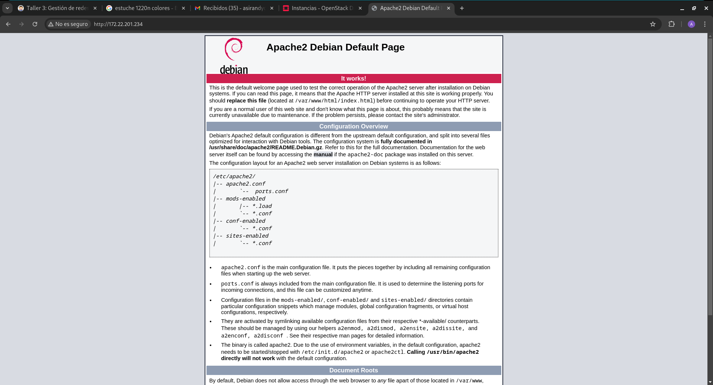

# Taller 2

Para esta ocasión lo que he hecho ha sido borrar todas ,las uintancias qu etenia en *openstack* y he levenatdo una:

```
madandy@toyota-hilux:~/Documentos/SegundoASIR/github/Servicios/uNIDAD4-openstack$ 
openstack server create \
  --image "Debian 12 Bookworm" \
  --flavor m1.normal \
  --key-name Andres \
  --network "Red de amorgon204" \
  taller2
+-----------------------------+------------------------------------------------------------------+
| Field                       | Value                                                            |
+-----------------------------+------------------------------------------------------------------+
| OS-DCF:diskConfig           | MANUAL                                                           |
| OS-EXT-AZ:availability_zone |                                                                  |
| OS-EXT-STS:power_state      | NOSTATE                                                          |
| OS-EXT-STS:task_state       | scheduling                                                       |
| OS-EXT-STS:vm_state         | building                                                         |
| OS-SRV-USG:launched_at      | None                                                             |
| OS-SRV-USG:terminated_at    | None                                                             |
| accessIPv4                  |                                                                  |
| accessIPv6                  |                                                                  |
| addresses                   |                                                                  |
| adminPass                   | zUXT77upbtQn                                                     |
| config_drive                |                                                                  |
| created                     | 2024-12-10T08:28:10Z                                             |
| flavor                      | m1.normal (4)                                                    |
| hostId                      |                                                                  |
| id                          | 148ff274-f0dc-483d-a046-728304eba2fa                             |
| image                       | Debian 12 Bookworm (e7caa035-5bb0-47fb-b9e8-ef73dce54499)        |
| key_name                    | Andres                                                           |
| name                        | taller2                                                          |
| progress                    | 0                                                                |
| project_id                  | b336d672575846eab6d9b12320abc89b                                 |
| properties                  |                                                                  |
| security_groups             | name='default'                                                   |
| status                      | BUILD                                                            |
| updated                     | 2024-12-10T08:28:10Z                                             |
| user_id                     | d51358567bc9740f12a572f84b755e2765b2183e8af3b4d8834c8526d765a484 |
| volumes_attached            |                                                                  |
+-----------------------------+------------------------------------------------------------------+

```

Pero lo primero que hice fue hacer los siguientes pasos:


```
madandy@toyota-hilux:~/Documentos/SegundoASIR/github/Servicios/uNIDAD4-openstack$ 
source Proyecto\ de\ amorgon204-openrc.sh 
Please enter your OpenStack Password for project Proyecto de amorgon204 as user amorgon204: 
madandy@toyota-hilux:~/Documentos/SegundoASIR/github/Servicios/uNIDAD4-openstack$ 
env | grep OS_
OS_REGION_NAME=RegionOne
OS_PROJECT_DOMAIN_ID=e2c0f2d89abe49db9f56a240a70467e6
OS_INTERFACE=public
OS_AUTH_URL=http://172.22.123.100/identity
OS_USERNAME=amorgon204
OS_PROJECT_ID=b336d672575846eab6d9b12320abc89b
OS_USER_DOMAIN_NAME=iesgn
OS_PROJECT_NAME=Proyecto de amorgon204
OS_PASSWORD=amorgon204
OS_IDENTITY_API_VERSION=3
madandy@toyota-hilux:~/Documentos/SegundoASIR/github/Servicios/uNIDAD4-openstack$ 
openstack --version
openstack 6.0.0
madandy@toyota-hilux:~/Documentos/SegundoASIR/github/Servicios/uNIDAD4-openstack$ 
 openstack keypair list
+--------+-------------------------------------------------+------+
| Name   | Fingerprint                                     | Type |
+--------+-------------------------------------------------+------+
| Andres | 75:e7:4b:1f:95:68:c0:ce:52:27:d4:f6:76:ec:f2:5f | ssh  |
+--------+-------------------------------------------------+------+
madandy@toyota-hilux:~/Documentos/SegundoASIR/github/Servicios/uNIDAD4-openstack$ 
openstack network list
+--------------------------------------+-------------------+--------------------------------------+
| ID                                   | Name              | Subnets                              |
+--------------------------------------+-------------------+--------------------------------------+
| 4ff6eee6-ef68-43f0-837d-1daee5963756 | Red de amorgon204 | 5b88b73c-32dd-4517-ba8b-f96ba38094e5 |
| 98d3f685-e398-43fa-812f-80c90371269d | ext-net           | ac19b62e-4454-467a-bfd3-1fb19693cf4c |
+--------------------------------------+-------------------+--------------------------------------+
madandy@toyota-hilux:~/Documentos/SegundoASIR/github/Servicios/uNIDAD4-openstack$ 
openstack keypair list
+--------+-------------------------------------------------+------+
| Name   | Fingerprint                                     | Type |
+--------+-------------------------------------------------+------+
| Andres | 75:e7:4b:1f:95:68:c0:ce:52:27:d4:f6:76:ec:f2:5f | ssh  |
+--------+-------------------------------------------------+------+
madandy@toyota-hilux:~/Documentos/SegundoASIR/github/Servicios/uNIDAD4-openstack$ 
openstack image list
+--------------------------------------+---------------------------------+--------+
| ID                                   | Name                            | Status |
+--------------------------------------+---------------------------------+--------+
| ec1c2230-3e7b-469c-856c-6e715a0501a1 | Cirros 0.6.2                    | active |
| e7caa035-5bb0-47fb-b9e8-ef73dce54499 | Debian 12 Bookworm              | active |
| 1a39c3de-cf79-4d17-a470-a490ba89b366 | Fedora-Cloud-Base-37-1.7.x86_64 | active |
| 52f6e1bd-edc0-49e8-87e2-c99a3f173d41 | Rocky Linux 9                   | active |
| d57c4744-177a-4f53-8db9-6368dc17f979 | Ubuntu 22.04 LTS                | active |
| e2cfdd56-7474-4772-a43c-ad0429f4b78e | Ubuntu 24.04 LTS                | active |
| ffebc834-5c2f-4319-b5b8-a0c360050d4f | cirros-0.6.2-x86_64-disk        | active |
+--------------------------------------+---------------------------------+--------+
madandy@toyota-hilux:~/Documentos/SegundoASIR/github/Servicios/uNIDAD4-openstack$ 
openstack flavor list
+----+------------+------+------+-----------+-------+-----------+
| ID | Name       |  RAM | Disk | Ephemeral | VCPUs | Is Public |
+----+------------+------+------+-----------+-------+-----------+
| 10 | vol.medium | 2048 |    0 |         0 |     2 | True      |
| 11 | vol.large  | 4096 |    0 |         0 |     2 | True      |
| 12 | vol.xlarge | 8192 |    0 |         0 |     4 | True      |
| 2  | m1.micro   |  256 |   10 |         0 |     1 | True      |
| 3  | m1.mini    |  512 |   10 |         0 |     1 | True      |
| 4  | m1.normal  | 1024 |   10 |         0 |     1 | True      |
| 5  | m1.medium  | 2048 |   20 |         0 |     2 | True      |
| 6  | m1.large   | 4096 |   20 |         0 |     2 | True      |
| 7  | m1.xlarge  | 8192 |   20 |         0 |     4 | True      |
| 8  | vol.mini   |  512 |    0 |         0 |     1 | True      |
| 9  | vol.normal | 1024 |    0 |         0 |     1 | True      |
+----+------------+------+------+-----------+-------+-----------+

```

Ahora asociare a la instancia un ared externa, para ello he realizado los siguientes pasos:

```
madandy@toyota-hilux:~/Documentos/SegundoASIR/github/Servicios/uNIDAD4-openstack$ 
openstack network list --external
+--------------------------------------+---------+--------------------------------------+
| ID                                   | Name    | Subnets                              |
+--------------------------------------+---------+--------------------------------------+
| 98d3f685-e398-43fa-812f-80c90371269d | ext-net | ac19b62e-4454-467a-bfd3-1fb19693cf4c |
+--------------------------------------+---------+--------------------------------------+
madandy@toyota-hilux:~/Documentos/SegundoASIR/github/Servicios/uNIDAD4-openstack$ 
openstack floating ip create ext-net     
+---------------------+--------------------------------------+
| Field               | Value                                |
+---------------------+--------------------------------------+
| created_at          | 2024-12-10T08:38:04Z                 |
| description         |                                      |
| dns_domain          |                                      |
| dns_name            |                                      |
| fixed_ip_address    | None                                 |
| floating_ip_address | 172.22.200.6                         |
| floating_network_id | 98d3f685-e398-43fa-812f-80c90371269d |
| id                  | 4d94f9cc-8fc9-43fc-a565-30efc229f2db |
| name                | 172.22.200.6                         |
| port_details        | None                                 |
| port_id             | None                                 |
| project_id          | b336d672575846eab6d9b12320abc89b     |
| qos_policy_id       | None                                 |
| revision_number     | 0                                    |
| router_id           | None                                 |
| status              | DOWN                                 |
| subnet_id           | None                                 |
| tags                | []                                   |
| updated_at          | 2024-12-10T08:38:04Z                 |
+---------------------+--------------------------------------+
madandy@toyota-hilux:~/Documentos/SegundoASIR/github/Servicios/uNIDAD4-openstack$ 
openstack server add floating ip taller2 172.22.200.6
madandy@toyota-hilux:~/Documentos/SegundoASIR/github/Servicios/uNIDAD4-openstack$ 
openstack server list
+--------------------------------------+---------+--------+--------------------------------------------+--------------------+-----------+
| ID                                   | Name    | Status | Networks                                   | Image              | Flavor    |
+--------------------------------------+---------+--------+--------------------------------------------+--------------------+-----------+
| 148ff274-f0dc-483d-a046-728304eba2fa | taller2 | ACTIVE | Red de amorgon204=10.0.0.163, 172.22.200.6 | Debian 12 Bookworm | m1.normal |
+--------------------------------------+---------+--------+--------------------------------------------+--------------------+-----------+

```

Creación y asociación de volumenes:

```
madandy@toyota-hilux:~/Documentos/SegundoASIR/github/Servicios/uNIDAD4-openstack$ 
openstack volume create --size 1 volumen-1gb
+---------------------+------------------------------------------------------------------+
| Field               | Value                                                            |
+---------------------+------------------------------------------------------------------+
| attachments         | []                                                               |
| availability_zone   | nova                                                             |
| bootable            | false                                                            |
| consistencygroup_id | None                                                             |
| created_at          | 2024-12-10T08:40:27.181092                                       |
| description         | None                                                             |
| encrypted           | False                                                            |
| id                  | f7996b12-75f6-43c5-96f5-d4111805335a                             |
| multiattach         | False                                                            |
| name                | volumen-1gb                                                      |
| properties          |                                                                  |
| replication_status  | None                                                             |
| size                | 1                                                                |
| snapshot_id         | None                                                             |
| source_volid        | None                                                             |
| status              | creating                                                         |
| type                | lvmdriver-1                                                      |
| updated_at          | None                                                             |
| user_id             | d51358567bc9740f12a572f84b755e2765b2183e8af3b4d8834c8526d765a484 |
+---------------------+------------------------------------------------------------------+
madandy@toyota-hilux:~/Documentos/SegundoASIR/github/Servicios/uNIDAD4-openstack$ 
openstack server list
+--------------------------------------+---------+--------+--------------------------------------------+--------------------+-----------+
| ID                                   | Name    | Status | Networks                                   | Image              | Flavor    |
+--------------------------------------+---------+--------+--------------------------------------------+--------------------+-----------+
| 148ff274-f0dc-483d-a046-728304eba2fa | taller2 | ACTIVE | Red de amorgon204=10.0.0.163, 172.22.200.6 | Debian 12 Bookworm | m1.normal |
+--------------------------------------+---------+--------+--------------------------------------------+--------------------+-----------+
madandy@toyota-hilux:~/Documentos/SegundoASIR/github/Servicios/uNIDAD4-openstack$ 
openstack server add volume taller2 volumen-1gb
+-----------------------+--------------------------------------+
| Field                 | Value                                |
+-----------------------+--------------------------------------+
| ID                    | f7996b12-75f6-43c5-96f5-d4111805335a |
| Server ID             | 148ff274-f0dc-483d-a046-728304eba2fa |
| Volume ID             | f7996b12-75f6-43c5-96f5-d4111805335a |
| Device                | /dev/vdb                             |
| Tag                   | None                                 |
| Delete On Termination | False                                |
+-----------------------+--------------------------------------+

```

Comprobamos enntrando en la instanciay metiendo por ocnsola *lsblk*:

```
debian@taller2:~$ lsblk
NAME    MAJ:MIN RM  SIZE RO TYPE MOUNTPOINTS
vda     254:0    0   10G  0 disk 
├─vda1  254:1    0  9.9G  0 part /
├─vda14 254:14   0    3M  0 part 
└─vda15 254:15   0  124M  0 part /boot/efi
vdb     254:16   0    1G  0 disk 
debian@taller2:~$ 

```

Ahora antes de redimensionar el volumen, la salida del comando df -h en la instancia:

```
debian@taller2:~$ sudo mkfs.ext4 /dev/vdb
mke2fs 1.47.0 (5-Feb-2023)
Discarding device blocks: done                            
Creating filesystem with 262144 4k blocks and 65536 inodes
Filesystem UUID: 02b2595c-f5d7-467f-a206-3ad00e8628b8
Superblock backups stored on blocks: 
	32768, 98304, 163840, 229376

Allocating group tables: done                            
Writing inode tables: done                            
Creating journal (8192 blocks): done
Writing superblocks and filesystem accounting information: done

debian@taller2:~$ sudo mkdir /mnt/volumen1
debian@taller2:~$ sudo mount /dev/vdb /mnt/volumen1
```
```
debian@taller2:~$ df -h
Filesystem      Size  Used Avail Use% Mounted on
udev            462M     0  462M   0% /dev
tmpfs            97M  520K   96M   1% /run
/dev/vda1       9.7G 1005M  8.3G  11% /
tmpfs           481M     0  481M   0% /dev/shm
tmpfs           5.0M     0  5.0M   0% /run/lock
/dev/vda15      124M   12M  113M  10% /boot/efi
tmpfs            97M     0   97M   0% /run/user/1000
/dev/vdb        974M   24K  907M   1% /mnt/volumen1


```

Comando OSC para redimensionar el volumen. La salida del comando df -h en la instancia donde hemos asociado el volumen, después de redimensionar el sistema de ficheros. 

Para ello vamos a tener que desaociar primero el volumen de la instancia, y una vez hecho vamos a redimensionarlo:

```

madandy@toyota-hilux:~/Documentos/SegundoASIR/github/Servicios/uNIDAD4-openstack$ 
openstack volume set --size 2 volumen-1gb
Failed to set volume size: Volume is in in-use state, it must be available before size can be extended
One or more of the set operations failed
madandy@toyota-hilux:~/Documentos/SegundoASIR/github/Servicios/uNIDAD4-openstack$ 
openstack server remove volume taller2 volumen-1gb
madandy@toyota-hilux:~/Documentos/SegundoASIR/github/Servicios/uNIDAD4-openstack$ 
openstack volume list
+--------------------------------------+-------------+-----------+------+-------------+
| ID                                   | Name        | Status    | Size | Attached to |
+--------------------------------------+-------------+-----------+------+-------------+
| f7996b12-75f6-43c5-96f5-d4111805335a | volumen-1gb | available |    1 |             |
+--------------------------------------+-------------+-----------+------+-------------+
madandy@toyota-hilux:~/Documentos/SegundoASIR/github/Servicios/uNIDAD4-openstack$ 
openstack volume set --size 2 volumen-1gb
```

Y lo vuelvo a asociar:

```
madandy@toyota-hilux:~/Documentos/SegundoASIR/github/Servicios/uNIDAD4-openstack$ 
openstack server add volume taller2 volumen-1gb
+-----------------------+--------------------------------------+
| Field                 | Value                                |
+-----------------------+--------------------------------------+
| ID                    | f7996b12-75f6-43c5-96f5-d4111805335a |
| Server ID             | 148ff274-f0dc-483d-a046-728304eba2fa |
| Volume ID             | f7996b12-75f6-43c5-96f5-d4111805335a |
| Device                | /dev/vdb                             |
| Tag                   | None                                 |
| Delete On Termination | False                                |
+-----------------------+--------------------------------------+


```

Y ahora una vez que tengo esto como ahora se llama vdc:

```
debian@taller2:~$ sudo mkfs.ext4 /dev/vdc
mke2fs 1.47.0 (5-Feb-2023)
/dev/vdc contains a ext4 file system
	last mounted on Tue Dec 10 08:46:18 2024
Proceed anyway? (y,N) y
Discarding device blocks: done                            
Creating filesystem with 524288 4k blocks and 131072 inodes
Filesystem UUID: a72b074b-75f6-4732-afde-6667dca8c300
Superblock backups stored on blocks: 
	32768, 98304, 163840, 229376, 294912

Allocating group tables: done                            
Writing inode tables: done                            
Creating journal (16384 blocks): 
done
Writing superblocks and filesystem accounting information: done 

debian@taller2:~$ sudo mkdir /mnt/volumen2
debian@taller2:~$ sudo mount /dev/vdc /mnt/volumen2
debian@taller2:~$ df -h
Filesystem      Size  Used Avail Use% Mounted on
udev            462M     0  462M   0% /dev
tmpfs            97M  520K   96M   1% /run
/dev/vda1       9.7G 1005M  8.3G  11% /
tmpfs           481M     0  481M   0% /dev/shm
tmpfs           5.0M     0  5.0M   0% /run/lock
/dev/vda15      124M   12M  113M  10% /boot/efi
/dev/vdb        974M   24K  907M   1% /mnt/volumen1
tmpfs            97M     0   97M   0% /run/user/1000
/dev/vdc        2.0G   24K  1.8G   1% /mnt/volumen2
debian@taller2:~$ 


```
Esto de abajo es la comprobación:

```

debian@taller2:~$ lsblk
NAME    MAJ:MIN RM  SIZE RO TYPE MOUNTPOINTS
vda     254:0    0   10G  0 disk 
├─vda1  254:1    0  9.9G  0 part /
├─vda14 254:14   0    3M  0 part 
└─vda15 254:15   0  124M  0 part /boot/efi
vdc     254:32   0    2G  0 disk /mnt/volumen2

```

Pregunta 4:

```
madandy@toyota-hilux:~/Documentos/SegundoASIR/github/Servicios/uNIDAD4-openstack$ 
openstack volume create --image "Debian 12 Bookworm" --bootable --size 5 volumen-arrancable
+---------------------+------------------------------------------------------------------+
| Field               | Value                                                            |
+---------------------+------------------------------------------------------------------+
| attachments         | []                                                               |
| availability_zone   | nova                                                             |
| bootable            | false                                                            |
| consistencygroup_id | None                                                             |
| created_at          | 2024-12-10T09:26:46.597877                                       |
| description         | None                                                             |
| encrypted           | False                                                            |
| id                  | 45553bd0-c2a7-4829-9e9c-5f6a96379e1a                             |
| multiattach         | False                                                            |
| name                | volumen-arrancable                                               |
| properties          |                                                                  |
| replication_status  | None                                                             |
| size                | 5                                                                |
| snapshot_id         | None                                                             |
| source_volid        | None                                                             |
| status              | creating                                                         |
| type                | lvmdriver-1                                                      |
| updated_at          | None                                                             |
| user_id             | d51358567bc9740f12a572f84b755e2765b2183e8af3b4d8834c8526d765a484 |
+---------------------+------------------------------------------------------------------+
madandy@toyota-hilux:~/Documentos/SegundoASIR/github/Servicios/uNIDAD4-openstack$ 


```
Ahora una vez que hemos creado el volumen-arrancable procedemos a hacer la máquina.
pregunta 5

```
madandy@toyota-hilux:~/Documentos/SegundoASIR/github/Servicios/uNIDAD4-openstack$ 
openstack server create --flavor vol.mini \
 --volume volumen-arrancable \
 --security-group default \
 --key-name Andres \
 --network "Red de amorgon204" \
 taller2-parte2
+-----------------------------+------------------------------------------------------------------+
| Field                       | Value                                                            |
+-----------------------------+------------------------------------------------------------------+
| OS-DCF:diskConfig           | MANUAL                                                           |
| OS-EXT-AZ:availability_zone |                                                                  |
| OS-EXT-STS:power_state      | NOSTATE                                                          |
| OS-EXT-STS:task_state       | scheduling                                                       |
| OS-EXT-STS:vm_state         | building                                                         |
| OS-SRV-USG:launched_at      | None                                                             |
| OS-SRV-USG:terminated_at    | None                                                             |
| accessIPv4                  |                                                                  |
| accessIPv6                  |                                                                  |
| addresses                   |                                                                  |
| adminPass                   | h6dXe9DYzMHA                                                     |
| config_drive                |                                                                  |
| created                     | 2024-12-10T09:36:33Z                                             |
| flavor                      | vol.mini (8)                                                     |
| hostId                      |                                                                  |
| id                          | 30745c26-4989-413a-819e-a79a19e39463                             |
| image                       | N/A (booted from volume)                                         |
| key_name                    | Andres                                                           |
| name                        | taller2-parte2                                                   |
| progress                    | 0                                                                |
| project_id                  | b336d672575846eab6d9b12320abc89b                                 |
| properties                  |                                                                  |
| security_groups             | name='52c8e408-fa9b-4309-9ecf-a5a665e8d1ac'                      |
| status                      | BUILD                                                            |
| updated                     | 2024-12-10T09:36:32Z                                             |
| user_id                     | d51358567bc9740f12a572f84b755e2765b2183e8af3b4d8834c8526d765a484 |
| volumes_attached            |                                                                  |
+-----------------------------+------------------------------------------------------------------+
madandy@toyota-hilux:~/Documentos/SegundoASIR/github/Servicios/uNIDAD4-openstack$ 

```

Para lo siguiente lo que hacemos es borrar la instancia y crear con el volumen

```
madandy@toyota-hilux:~/Documentos/SegundoASIR/github/Servicios/uNIDAD4-openstack$ 
openstack server delete taller2-parte2
madandy@toyota-hilux:~/Documentos/SegundoASIR/github/Servicios/uNIDAD4-openstack$ 
openstack server create --flavor vol.mini \
 --volume volumen-arrancable \
 --security-group default \
 --key-name Andres \
 --network "Red de amorgon204" \
 taller2-comprobacionNginx
+-----------------------------+------------------------------------------------------------------+
| Field                       | Value                                                            |
+-----------------------------+------------------------------------------------------------------+
| OS-DCF:diskConfig           | MANUAL                                                           |
| OS-EXT-AZ:availability_zone |                                                                  |
| OS-EXT-STS:power_state      | NOSTATE                                                          |
| OS-EXT-STS:task_state       | scheduling                                                       |
| OS-EXT-STS:vm_state         | building                                                         |
| OS-SRV-USG:launched_at      | None                                                             |
| OS-SRV-USG:terminated_at    | None                                                             |
| accessIPv4                  |                                                                  |
| accessIPv6                  |                                                                  |
| addresses                   |                                                                  |
| adminPass                   | hEgYj2tpWmMp                                                     |
| config_drive                |                                                                  |
| created                     | 2024-12-10T10:48:06Z                                             |
| flavor                      | vol.mini (8)                                                     |
| hostId                      |                                                                  |
| id                          | c9d002cf-b3ae-403e-b321-2dbb598203bf                             |
| image                       | N/A (booted from volume)                                         |
| key_name                    | Andres                                                           |
| name                        | taller2-comprobacionNginx                                        |
| progress                    | 0                                                                |
| project_id                  | b336d672575846eab6d9b12320abc89b                                 |
| properties                  |                                                                  |
| security_groups             | name='52c8e408-fa9b-4309-9ecf-a5a665e8d1ac'                      |
| status                      | BUILD                                                            |
| updated                     | 2024-12-10T10:48:06Z                                             |
| user_id                     | d51358567bc9740f12a572f84b755e2765b2183e8af3b4d8834c8526d765a484 |
| volumes_attached            |                                                                  |
+-----------------------------+------------------------------------------------------------------+

```

Ahora vemos que ip flotante tenemos sin asignar y se la asociamos a lo que es nuestra intanscia:

```
adandy@toyota-hilux:~/Documentos/SegundoASIR/github/Servicios/uNIDAD4-openstack$ 
openstack floating ip list 
+--------------------------------------+---------------------+------------------+--------------------------------------+--------------------------------------+----------------------------------+
| ID                                   | Floating IP Address | Fixed IP Address | Port                                 | Floating Network                     | Project                          |
+--------------------------------------+---------------------+------------------+--------------------------------------+--------------------------------------+----------------------------------+
| 0c991bb2-e0ed-4174-88af-de23756a09ac | 172.22.200.213      | None             | None                                 | 98d3f685-e398-43fa-812f-80c90371269d | b336d672575846eab6d9b12320abc89b |
| 421a7b9d-0d1f-4692-ba34-e7c5ab879667 | 172.22.200.190      | None             | None                                 | 98d3f685-e398-43fa-812f-80c90371269d | b336d672575846eab6d9b12320abc89b |
| 4d94f9cc-8fc9-43fc-a565-30efc229f2db | 172.22.200.6        | 10.0.0.163       | 09fdd000-7361-4f0e-a93d-633dc50a3637 | 98d3f685-e398-43fa-812f-80c90371269d | b336d672575846eab6d9b12320abc89b |
| df8bf75b-2394-41a2-8370-7afccb8a1ed2 | 172.22.201.234      | None             | None                                 | 98d3f685-e398-43fa-812f-80c90371269d | b336d672575846eab6d9b12320abc89b |
+--------------------------------------+---------------------+------------------+--------------------------------------+--------------------------------------+----------------------------------+
madandy@toyota-hilux:~/Documentos/SegundoASIR/github/Servicios/uNIDAD4-openstack$ 
openstack server add floating ip taller2-comprobacionNginx 172.22.200.190

```

Entramso por ssh y vemos la version:

```
debian@taller2-comprobacionnginx:~$ apt policy nginx
nginx:
  Installed: 1.22.1-9
  Candidate: 1.22.1-9
  Version table:
 *** 1.22.1-9 500
        500 mirror+file:/etc/apt/mirrors/debian.list bookworm/main amd64 Packages
        100 /var/lib/dpkg/status

```

# taller 3

LO primero que vamos a hacer es crear una nueva red (red-externa)

```
madandy@toyota-hilux:~/Documentos/SegundoASIR/github/Servicios/uNIDAD4-openstack$ 
openstack network create red-externa
+---------------------------+--------------------------------------+
| Field                     | Value                                |
+---------------------------+--------------------------------------+
| admin_state_up            | UP                                   |
| availability_zone_hints   |                                      |
| availability_zones        |                                      |
| created_at                | 2024-12-11T10:58:20Z                 |
| description               |                                      |
| dns_domain                | None                                 |
| id                        | 6d03efcd-e1c8-45fb-9381-eb3c1fb1ed9a |
| ipv4_address_scope        | None                                 |
| ipv6_address_scope        | None                                 |
| is_default                | False                                |
| is_vlan_transparent       | None                                 |
| mtu                       | 1442                                 |
| name                      | red-externa                          |
| port_security_enabled     | True                                 |
| project_id                | b336d672575846eab6d9b12320abc89b     |
| provider:network_type     | None                                 |
| provider:physical_network | None                                 |
| provider:segmentation_id  | None                                 |
| qos_policy_id             | None                                 |
| revision_number           | 1                                    |
| router:external           | Internal                             |
| segments                  | None                                 |
| shared                    | False                                |
| status                    | ACTIVE                               |
| subnets                   |                                      |
| tags                      |                                      |
| updated_at                | 2024-12-11T10:58:20Z                 |
+---------------------------+--------------------------------------+

```
Crear la subred con DHCP, DNS y direccionamiento 

```
madandy@toyota-hilux:~/Documentos/SegundoASIR/github/Servicios/uNIDAD4-openstack$ 
openstack subnet create \
    --network red-externa \
    --subnet-range 192.168.0.0/24 \
    --dns-nameserver 172.22.0.1 \
    --dhcp \
    red-externa-subnet
+----------------------+--------------------------------------+
| Field                | Value                                |
+----------------------+--------------------------------------+
| allocation_pools     | 192.168.0.2-192.168.0.254            |
| cidr                 | 192.168.0.0/24                       |
| created_at           | 2024-12-11T10:58:31Z                 |
| description          |                                      |
| dns_nameservers      | 172.22.0.1                           |
| dns_publish_fixed_ip | None                                 |
| enable_dhcp          | True                                 |
| gateway_ip           | 192.168.0.1                          |
| host_routes          |                                      |
| id                   | 03e25fa4-ae1c-415e-b221-ca9ba4f940a2 |
| ip_version           | 4                                    |
| ipv6_address_mode    | None                                 |
| ipv6_ra_mode         | None                                 |
| name                 | red-externa-subnet                   |
| network_id           | 6d03efcd-e1c8-45fb-9381-eb3c1fb1ed9a |
| project_id           | b336d672575846eab6d9b12320abc89b     |
| revision_number      | 0                                    |
| segment_id           | None                                 |
| service_types        |                                      |
| subnetpool_id        | None                                 |
| tags                 |                                      |
| updated_at           | 2024-12-11T10:58:31Z                 |
+----------------------+--------------------------------------+


```

Ahora crearemos un router y procederemos a conectarlo::

```
madandy@toyota-hilux:~/Documentos/SegundoASIR/github/Servicios/uNIDAD4-openstack$ 
openstack router create router-nuevo
+-------------------------+--------------------------------------+
| Field                   | Value                                |
+-------------------------+--------------------------------------+
| admin_state_up          | UP                                   |
| availability_zone_hints |                                      |
| availability_zones      |                                      |
| created_at              | 2024-12-11T11:00:40Z                 |
| description             |                                      |
| enable_ndp_proxy        | None                                 |
| external_gateway_info   | null                                 |
| flavor_id               | None                                 |
| id                      | 369303a3-6fb2-4499-b1f2-6ebb65265ace |
| name                    | router-nuevo                         |
| project_id              | b336d672575846eab6d9b12320abc89b     |
| revision_number         | 1                                    |
| routes                  |                                      |
| status                  | ACTIVE                               |
| tags                    |                                      |
| tenant_id               | b336d672575846eab6d9b12320abc89b     |
| updated_at              | 2024-12-11T11:00:40Z                 |
+-------------------------+--------------------------------------+

```

Conectar el router a la red:

```
madandy@toyota-hilux:~/Documentos/SegundoASIR/github/Servicios/uNIDAD4-openstack$ 
openstack router add subnet router-nuevo red-externa-subnet

```

Conectar el router a la red prublica:

```
madandy@toyota-hilux:~/Documentos/SegundoASIR/github/Servicios/uNIDAD4-openstack$ 
openstack router set router-nuevo --external-gateway ext-net

```

Ahora creamos una instanacia (maquina-router)

```
madandy@toyota-hilux:~/Documentos/SegundoASIR/github/Servicios/uNIDAD4-openstack$ 
openstack server create \
    --flavor m1.normal \
    --image "Debian 12 Bookworm" \
    --network red-externa \
    --key-name Andres \
    maquina-router
+-----------------------------+------------------------------------------------------------------+
| Field                       | Value                                                            |
+-----------------------------+------------------------------------------------------------------+
| OS-DCF:diskConfig           | MANUAL                                                           |
| OS-EXT-AZ:availability_zone |                                                                  |
| OS-EXT-STS:power_state      | NOSTATE                                                          |
| OS-EXT-STS:task_state       | scheduling                                                       |
| OS-EXT-STS:vm_state         | building                                                         |
| OS-SRV-USG:launched_at      | None                                                             |
| OS-SRV-USG:terminated_at    | None                                                             |
| accessIPv4                  |                                                                  |
| accessIPv6                  |                                                                  |
| addresses                   |                                                                  |
| adminPass                   | M9sLfbirzcvD                                                     |
| config_drive                |                                                                  |
| created                     | 2024-12-11T11:03:46Z                                             |
| flavor                      | m1.normal (4)                                                    |
| hostId                      |                                                                  |
| id                          | c1f5abe8-f136-45bd-a1c6-43c841c2d1ed                             |
| image                       | Debian 12 Bookworm (e7caa035-5bb0-47fb-b9e8-ef73dce54499)        |
| key_name                    | Andres                                                           |
| name                        | maquina-router                                                   |
| progress                    | 0                                                                |
| project_id                  | b336d672575846eab6d9b12320abc89b                                 |
| properties                  |                                                                  |
| security_groups             | name='default'                                                   |
| status                      | BUILD                                                            |
| updated                     | 2024-12-11T11:03:45Z                                             |
| user_id                     | d51358567bc9740f12a572f84b755e2765b2183e8af3b4d8834c8526d765a484 |
| volumes_attached            |                                                                  |
+-----------------------------+------------------------------------------------------------------+

```
 Añadimos IP flotante:

- Para ello lo primero que hare sera ver si tengo alguna sin asignar:

```
madandy@toyota-hilux:~/Documentos/SegundoASIR/github/Servicios/uNIDAD4-openstack$ 
openstack floating ip list
+--------------------------------------+---------------------+------------------+--------------------------------------+--------------------------------------+----------------------------------+
| ID                                   | Floating IP Address | Fixed IP Address | Port                                 | Floating Network                     | Project                          |
+--------------------------------------+---------------------+------------------+--------------------------------------+--------------------------------------+----------------------------------+
| 0c991bb2-e0ed-4174-88af-de23756a09ac | 172.22.200.213      | None             | None                                 | 98d3f685-e398-43fa-812f-80c90371269d | b336d672575846eab6d9b12320abc89b |
| 421a7b9d-0d1f-4692-ba34-e7c5ab879667 | 172.22.200.190      | 10.0.0.214       | 0f7d2990-701b-417e-a534-4b7243ae0614 | 98d3f685-e398-43fa-812f-80c90371269d | b336d672575846eab6d9b12320abc89b |
| 4d94f9cc-8fc9-43fc-a565-30efc229f2db | 172.22.200.6        | 10.0.0.163       | 09fdd000-7361-4f0e-a93d-633dc50a3637 | 98d3f685-e398-43fa-812f-80c90371269d | b336d672575846eab6d9b12320abc89b |
| df8bf75b-2394-41a2-8370-7afccb8a1ed2 | 172.22.201.234      | None             | None                                 | 98d3f685-e398-43fa-812f-80c90371269d | b336d672575846eab6d9b12320abc89b |
+--------------------------------------+---------------------+------------------+--------------------------------------+--------------------------------------+----------------------------------+

```

Y añadimos a nuestra máquina:

```
madandy@toyota-hilux:~/Documentos/SegundoASIR/github/Servicios/uNIDAD4-openstack$ 
openstack server add floating ip maquina-router 172.22.201.234

```

Y verificamos:

```
madandy@toyota-hilux:~/Documentos/SegundoASIR/github/Servicios/uNIDAD4-openstack$ 
openstack floating ip list
+--------------------------------------+---------------------+------------------+--------------------------------------+--------------------------------------+----------------------------------+
| ID                                   | Floating IP Address | Fixed IP Address | Port                                 | Floating Network                     | Project                          |
+--------------------------------------+---------------------+------------------+--------------------------------------+--------------------------------------+----------------------------------+
| 0c991bb2-e0ed-4174-88af-de23756a09ac | 172.22.200.213      | None             | None                                 | 98d3f685-e398-43fa-812f-80c90371269d | b336d672575846eab6d9b12320abc89b |
| 421a7b9d-0d1f-4692-ba34-e7c5ab879667 | 172.22.200.190      | 10.0.0.214       | 0f7d2990-701b-417e-a534-4b7243ae0614 | 98d3f685-e398-43fa-812f-80c90371269d | b336d672575846eab6d9b12320abc89b |
| 4d94f9cc-8fc9-43fc-a565-30efc229f2db | 172.22.200.6        | 10.0.0.163       | 09fdd000-7361-4f0e-a93d-633dc50a3637 | 98d3f685-e398-43fa-812f-80c90371269d | b336d672575846eab6d9b12320abc89b |
| df8bf75b-2394-41a2-8370-7afccb8a1ed2 | 172.22.201.234      | 192.168.0.140    | 0fe5a75e-a016-4286-8164-a0e88b6535ad | 98d3f685-e398-43fa-812f-80c90371269d | b336d672575846eab6d9b12320abc89b |
+--------------------------------------+---------------------+------------------+--------------------------------------+--------------------------------------+----------------------------------+
madandy@toyota-hilux:~/Documentos/SegundoASIR/github/Servicios/uNIDAD4-openstack$ 

```

Ahora cremos una nueva red (que será la red-interna)

1. CRear la rfed y la subred 

- Creación de red

```
madandy@toyota-hilux:~/Documentos/SegundoASIR/github/Servicios/uNIDAD4-openstack$ 
openstack network create red-interna
+---------------------------+--------------------------------------+
| Field                     | Value                                |
+---------------------------+--------------------------------------+
| admin_state_up            | UP                                   |
| availability_zone_hints   |                                      |
| availability_zones        |                                      |
| created_at                | 2024-12-11T11:07:53Z                 |
| description               |                                      |
| dns_domain                | None                                 |
| id                        | ea54761e-5d08-4074-9bbf-7f97c029f3bd |
| ipv4_address_scope        | None                                 |
| ipv6_address_scope        | None                                 |
| is_default                | False                                |
| is_vlan_transparent       | None                                 |
| mtu                       | 1442                                 |
| name                      | red-interna                          |
| port_security_enabled     | True                                 |
| project_id                | b336d672575846eab6d9b12320abc89b     |
| provider:network_type     | None                                 |
| provider:physical_network | None                                 |
| provider:segmentation_id  | None                                 |
| qos_policy_id             | None                                 |
| revision_number           | 1                                    |
| router:external           | Internal                             |
| segments                  | None                                 |
| shared                    | False                                |
| status                    | ACTIVE                               |
| subnets                   |                                      |
| tags                      |                                      |
| updated_at                | 2024-12-11T11:07:54Z                 |
+---------------------------+--------------------------------------+


```

- Creacion de subred

```
madandy@toyota-hilux:~/Documentos/SegundoASIR/github/Servicios/uNIDAD4-openstack$ 
openstack subnet create \
    --network red-interna \
    --subnet-range 10.0.100.0/24 \
    --dns-nameserver 172.22.0.1 \
    --dhcp \
    red-interna-subnet
+----------------------+--------------------------------------+
| Field                | Value                                |
+----------------------+--------------------------------------+
| allocation_pools     | 10.0.100.2-10.0.100.254              |
| cidr                 | 10.0.100.0/24                        |
| created_at           | 2024-12-11T11:08:38Z                 |
| description          |                                      |
| dns_nameservers      | 172.22.0.1                           |
| dns_publish_fixed_ip | None                                 |
| enable_dhcp          | True                                 |
| gateway_ip           | 10.0.100.1                           |
| host_routes          |                                      |
| id                   | fdeb76f2-8606-45c1-be97-70c1f65f40e7 |
| ip_version           | 4                                    |
| ipv6_address_mode    | None                                 |
| ipv6_ra_mode         | None                                 |
| name                 | red-interna-subnet                   |
| network_id           | ea54761e-5d08-4074-9bbf-7f97c029f3bd |
| project_id           | b336d672575846eab6d9b12320abc89b     |
| revision_number      | 0                                    |
| segment_id           | None                                 |
| service_types        |                                      |
| subnetpool_id        | None                                 |
| tags                 |                                      |
| updated_at           | 2024-12-11T11:08:38Z                 |
+----------------------+--------------------------------------+

```

5. Conectar maquina-router a red-interna

- Creo un puerto en la red inetrna:


```
madandy@toyota-hilux:~/Documentos/SegundoASIR/github/Servicios/uNIDAD4-openstack$ 
openstack port create \
    --network red-interna \
    --fixed-ip subnet=red-interna-subnet,ip-address=10.0.100.1 \
    maquina-router-internal-port
+-------------------------+---------------------------------------------------------------------------+
| Field                   | Value                                                                     |
+-------------------------+---------------------------------------------------------------------------+
| admin_state_up          | UP                                                                        |
| allowed_address_pairs   |                                                                           |
| binding_host_id         | None                                                                      |
| binding_profile         | None                                                                      |
| binding_vif_details     | None                                                                      |
| binding_vif_type        | None                                                                      |
| binding_vnic_type       | normal                                                                    |
| created_at              | 2024-12-11T11:09:55Z                                                      |
| data_plane_status       | None                                                                      |
| description             |                                                                           |
| device_id               |                                                                           |
| device_owner            |                                                                           |
| device_profile          | None                                                                      |
| dns_assignment          | None                                                                      |
| dns_domain              | None                                                                      |
| dns_name                | None                                                                      |
| extra_dhcp_opts         |                                                                           |
| fixed_ips               | ip_address='10.0.100.1', subnet_id='fdeb76f2-8606-45c1-be97-70c1f65f40e7' |
| id                      | 1a8efed2-81d2-43a7-a47e-cacb6b401c68                                      |
| ip_allocation           | None                                                                      |
| mac_address             | fa:16:3e:02:1a:73                                                         |
| name                    | maquina-router-internal-port                                              |
| network_id              | ea54761e-5d08-4074-9bbf-7f97c029f3bd                                      |
| numa_affinity_policy    | None                                                                      |
| port_security_enabled   | True                                                                      |
| project_id              | b336d672575846eab6d9b12320abc89b                                          |
| propagate_uplink_status | None                                                                      |
| qos_network_policy_id   | None                                                                      |
| qos_policy_id           | None                                                                      |
| resource_request        | None                                                                      |
| revision_number         | 1                                                                         |
| security_group_ids      | 52c8e408-fa9b-4309-9ecf-a5a665e8d1ac                                      |
| status                  | DOWN                                                                      |
| tags                    |                                                                           |
| trunk_details           | None                                                                      |
| updated_at              | 2024-12-11T11:09:55Z                                                      |
+-------------------------+---------------------------------------------------------------------------+


```

- COnectar el puerto a la instancia:

```
madandy@toyota-hilux:~/Documentos/SegundoASIR/github/Servicios/uNIDAD4-openstack$ 
openstack server add port maquina-router maquina-router-internal-port


```

6. Creao maquina-cliente en red-interna

- Creo la instancia con una IP fija:

```
madandy@toyota-hilux:~/Documentos/SegundoASIR/github/Servicios/uNIDAD4-openstack$ 
openstack port create \
    --network red-interna \
    --fixed-ip subnet=red-interna-subnet,ip-address=10.0.100.200 \
    maquina-cliente-port
+-------------------------+-----------------------------------------------------------------------------+
| Field                   | Value                                                                       |
+-------------------------+-----------------------------------------------------------------------------+
| admin_state_up          | UP                                                                          |
| allowed_address_pairs   |                                                                             |
| binding_host_id         | None                                                                        |
| binding_profile         | None                                                                        |
| binding_vif_details     | None                                                                        |
| binding_vif_type        | None                                                                        |
| binding_vnic_type       | normal                                                                      |
| created_at              | 2024-12-11T11:11:36Z                                                        |
| data_plane_status       | None                                                                        |
| description             |                                                                             |
| device_id               |                                                                             |
| device_owner            |                                                                             |
| device_profile          | None                                                                        |
| dns_assignment          | None                                                                        |
| dns_domain              | None                                                                        |
| dns_name                | None                                                                        |
| extra_dhcp_opts         |                                                                             |
| fixed_ips               | ip_address='10.0.100.200', subnet_id='fdeb76f2-8606-45c1-be97-70c1f65f40e7' |
| id                      | ca3d6c04-6410-47f3-8e7b-f1f270eb3acc                                        |
| ip_allocation           | None                                                                        |
| mac_address             | fa:16:3e:86:db:16                                                           |
| name                    | maquina-cliente-port                                                        |
| network_id              | ea54761e-5d08-4074-9bbf-7f97c029f3bd                                        |
| numa_affinity_policy    | None                                                                        |
| port_security_enabled   | True                                                                        |
| project_id              | b336d672575846eab6d9b12320abc89b                                            |
| propagate_uplink_status | None                                                                        |
| qos_network_policy_id   | None                                                                        |
| qos_policy_id           | None                                                                        |
| resource_request        | None                                                                        |
| revision_number         | 1                                                                           |
| security_group_ids      | 52c8e408-fa9b-4309-9ecf-a5a665e8d1ac                                        |
| status                  | DOWN                                                                        |
| tags                    |                                                                             |
| trunk_details           | None                                                                        |
| updated_at              | 2024-12-11T11:11:36Z                                                        |
+-------------------------+-----------------------------------------------------------------------------+


```

- Crear la instancia conectada a ese puerto:
```
madandy@toyota-hilux:~/Documentos/SegundoASIR/github/Servicios/uNIDAD4-openstack$ 
openstack server create \
    --flavor m1.normal \
    --image "Debian 12 Bookworm" \
    --port maquina-cliente-port \
    --key-name Andres \
    maquina-cliente
+-----------------------------+------------------------------------------------------------------+
| Field                       | Value                                                            |
+-----------------------------+------------------------------------------------------------------+
| OS-DCF:diskConfig           | MANUAL                                                           |
| OS-EXT-AZ:availability_zone |                                                                  |
| OS-EXT-STS:power_state      | NOSTATE                                                          |
| OS-EXT-STS:task_state       | scheduling                                                       |
| OS-EXT-STS:vm_state         | building                                                         |
| OS-SRV-USG:launched_at      | None                                                             |
| OS-SRV-USG:terminated_at    | None                                                             |
| accessIPv4                  |                                                                  |
| accessIPv6                  |                                                                  |
| addresses                   |                                                                  |
| adminPass                   | 8LxWecqHqCGi                                                     |
| config_drive                |                                                                  |
| created                     | 2024-12-11T11:12:38Z                                             |
| flavor                      | m1.normal (4)                                                    |
| hostId                      |                                                                  |
| id                          | 75810ed7-872c-4095-8f02-1c62d251ad18                             |
| image                       | Debian 12 Bookworm (e7caa035-5bb0-47fb-b9e8-ef73dce54499)        |
| key_name                    | Andres                                                           |
| name                        | maquina-cliente                                                  |
| progress                    | 0                                                                |
| project_id                  | b336d672575846eab6d9b12320abc89b                                 |
| properties                  |                                                                  |
| security_groups             | name='default'                                                   |
| status                      | BUILD                                                            |
| updated                     | 2024-12-11T11:12:38Z                                             |
| user_id                     | d51358567bc9740f12a572f84b755e2765b2183e8af3b4d8834c8526d765a484 |
| volumes_attached            |                                                                  |
+-----------------------------+------------------------------------------------------------------+

```
Ahora antes de seguir he tenido que hacer lo siguiente:


```
debian@maquina-router:~$ sudo ip link set ens7 up
debian@maquina-router:~$ sudo ip addr add 10.0.100.1/24 dev ens7
debian@maquina-router:~$ ip a
1: lo: <LOOPBACK,UP,LOWER_UP> mtu 65536 qdisc noqueue state UNKNOWN group default qlen 1000
    link/loopback 00:00:00:00:00:00 brd 00:00:00:00:00:00
    inet 127.0.0.1/8 scope host lo
       valid_lft forever preferred_lft forever
    inet6 ::1/128 scope host noprefixroute 
       valid_lft forever preferred_lft forever
2: ens3: <BROADCAST,MULTICAST,UP,LOWER_UP> mtu 1442 qdisc fq_codel state UP group default qlen 1000
    link/ether fa:16:3e:5d:57:89 brd ff:ff:ff:ff:ff:ff
    altname enp0s3
    inet 192.168.0.140/24 metric 100 brd 192.168.0.255 scope global dynamic ens3
       valid_lft 42227sec preferred_lft 42227sec
    inet6 fe80::f816:3eff:fe5d:5789/64 scope link 
       valid_lft forever preferred_lft forever
3: ens7: <BROADCAST,MULTICAST,UP,LOWER_UP> mtu 1442 qdisc fq_codel state UP group default qlen 1000
    link/ether fa:16:3e:02:1a:73 brd ff:ff:ff:ff:ff:ff
    altname enp0s7
    inet 10.0.100.1/24 scope global ens7
       valid_lft forever preferred_lft forever
    inet6 fe80::f816:3eff:fe02:1a73/64 scope link 
       valid_lft forever preferred_lft forever


```
Desahbilitar el puerto para que se haganb ping:

```
madandy@toyota-hilux:~/Documentos/SegundoASIR/github/Servicios/uNIDAD4-openstack$ 
openstack server remove security group maquina-cliente default
Security group 52c8e408-fa9b-4309-9ecf-a5a665e8d1ac not associated with the instance 75810ed7-872c-4095-8f02-1c62d251ad18 (HTTP 404) (Request-ID: req-1587f136-58bb-483a-8633-ce47386064b4)
madandy@toyota-hilux:~/Documentos/SegundoASIR/github/Servicios/uNIDAD4-openstack$ 
openstack port set --disable-port-security ca3d6c04-6410-47f3-8e7b-f1f270eb3acc
madandy@toyota-hilux:~/Documentos/SegundoASIR/github/Servicios/uNIDAD4-openstack$ 
openstack server remove security group maquina-router default
madandy@toyota-hilux:~/Documentos/SegundoASIR/github/Servicios/uNIDAD4-openstack$ 
openstack port set --disable-port-security 0fe5a75e-a016-4286-8164-a0e88b6535ad
madandy@toyota-hilux:~/Documentos/SegundoASIR/github/Servicios/uNIDAD4-openstack$ 
openstack port set --disable-port-security 1a8efed2-81d2-43a7-a47e-cacb6b401c68
madandy@toyota-hilux:~/Documentos/SegundoASIR/github/Servicios/uNIDAD4-openstack$ 

```

Ahora habilitarmos e trafico:


```
# Habilitar NAT para permitir que el tráfico desde la red interna use la interfaz externa (ens3) para salir a Internet
sudo iptables -t nat -A POSTROUTING -o ens3 -j MASQUERADE

# Permitir el reenvío de paquetes desde la red interna (ens7) hacia cualquier destino
sudo iptables -A FORWARD -i ens7 -j ACCEPT

# Permitir el reenvío de paquetes hacia la red interna (ens7) desde cualquier origen
sudo iptables -A FORWARD -o ens7 -j ACCEPT

```

AHora hago un proxy njump desde mi host y podemos entrar:

```
madandy@toyota-hilux:~$ 
ssh maquina-cliente 
The authenticity of host '10.0.100.200 (<no hostip for proxy command>)' can't be established.
ED25519 key fingerprint is SHA256:/GzINuw6uMmk7VfGbaMTqTwiBcA68fWPOhAj7BijBAw.
This key is not known by any other names.
Are you sure you want to continue connecting (yes/no/[fingerprint])? yes
Warning: Permanently added '10.0.100.200' (ED25519) to the list of known hosts.
Linux maquina-cliente 6.1.0-28-amd64 #1 SMP PREEMPT_DYNAMIC Debian 6.1.119-1 (2024-11-22) x86_64

The programs included with the Debian GNU/Linux system are free software;
the exact distribution terms for each program are described in the
individual files in /usr/share/doc/*/copyright.

Debian GNU/Linux comes with ABSOLUTELY NO WARRANTY, to the extent
permitted by applicable law.
debian@maquina-cliente:~$ 

```

Ahora lo que procedemos es a instalar apache2 en la maquina-cliente:

```
debian@maquina-cliente:~$ sudo systemctl status apache2
● apache2.service - The Apache HTTP Server
     Loaded: loaded (/lib/systemd/system/apache2.service; enabled; preset: enab>
     Active: active (running) since Thu 2024-12-12 08:59:27 UTC; 1min 3s ago
       Docs: https://httpd.apache.org/docs/2.4/
   Main PID: 1922 (apache2)
      Tasks: 55 (limit: 1108)
     Memory: 11.1M
        CPU: 54ms
     CGroup: /system.slice/apache2.service
             ├─1922 /usr/sbin/apache2 -k start
             ├─1924 /usr/sbin/apache2 -k start
             └─1925 /usr/sbin/apache2 -k start

Dec 12 08:59:27 maquina-cliente systemd[1]: Starting apache2.service - The Apac>
Dec 12 08:59:27 maquina-cliente apachectl[1921]: AH00558: apache2: Could not re>
Dec 12 08:59:27 maquina-cliente systemd[1]: Started apache2.service - The Apach>
lines 1-16/16 (END)

```
y ahora lo que queremos ver es la pagina de apache lo que he tenido que hacer es ponerle las reglas DNAT en la máquina Router:

```
debian@maquina-router:~$ sudo iptables -t nat -A PREROUTING -i ens3 -p tcp --dport 80 -j DNAT --to-destination 10.0.100.200:80
debian@maquina-router:~$ sudo iptables -A FORWARD -i ens3 -p tcp --dport 80 -d 10.0.100.200 -j ACCEPT


```
Y comprokbamos la reglas que estan establecidas:

```
debian@maquina-router:~$ sudo iptables -t nat -L -v -n
Chain PREROUTING (policy ACCEPT 0 packets, 0 bytes)
 pkts bytes target     prot opt in     out     source               destination         
    0     0 DNAT       6    --  ens3   *       0.0.0.0/0            0.0.0.0/0            tcp dpt:80 to:10.0.100.200:80

Chain INPUT (policy ACCEPT 0 packets, 0 bytes)
 pkts bytes target     prot opt in     out     source               destination         

Chain OUTPUT (policy ACCEPT 0 packets, 0 bytes)
 pkts bytes target     prot opt in     out     source               destination         

Chain POSTROUTING (policy ACCEPT 0 packets, 0 bytes)
 pkts bytes target     prot opt in     out     source               destination         
  109  8849 MASQUERADE  0    --  *      ens3    0.0.0.0/0            0.0.0.0/0           

```


Y hacemos la comprobación que podemos acceder desde la *ip flotante*:

