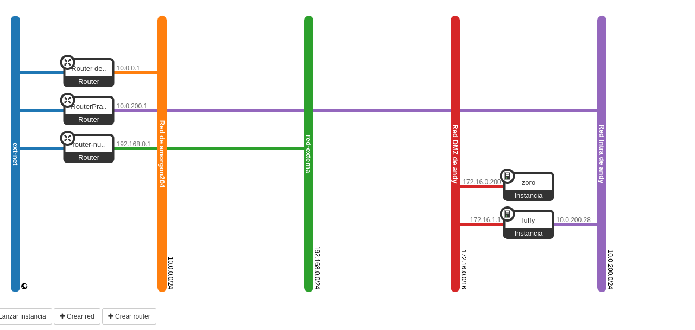

# Práctica (1 / 2): Escenario en OpenStack

En esta tarea se va a crear el escenario de trabajo que se va a usar durante todo el curso, que va a constar inicialmente de 4 máquinas: 2 instancias en OpenStack y dos contenedores LXC que se ejecutarán en una de las instancias.

Para nombrar las máquinas se van a utilizar los siguientes nombres: ***luffy, zoro, nami, sanji***. Estos nombres pertenecen la serie manga ***One Piece***.

Además el dominio será un subdominio de la forma ```tunombre.gonzalonazareno.org```. De esta forma tendremos:

- Máquina 1: Instancia en OpenStack con ***Debian 12 Bookworm*** que se llama ```luffy.tunombre.gonzalonazareno.org```.

- Máquina 2: Instancia en OpenStack con ***Rocky Linux 9*** que se llama ```zoro.tunombre.gonzalonazareno.org```.

- Máquina 3: Contenedor LXC con ***Ubuntu 22.04*** que se llama ```nami.tunombre.gonzalonazareno.org```.

- Máquina 4: Contenedor LXC con ***Ubuntu 22.04*** que se llama ```sanji.tunombre.gonzalonazareno.org```.

Todas las operaciones que realices sobre recursos de OpenStack lo tienes que hacer usando OSC.

## Escenario


## Creación de la infraestructura de red

* Crea un nuevo router llamado RouterPractica conectado a la red externa.

* Crea una red interna que se llame Red Intra de tu_usuario, con las siguientes características:

  - Está conectada al router que has creado en el punto anterior.

  - Direccionamiento: 10.0.200.0/24

  - Con DHCP y DNS (172.22.0.1).

  - La puerta de enlace de los dispositivos conectados a esta red será el 10.0.200.1.

* Crea una red interna que se llame Red DMZ de tu_usuario, con las siguientes características:

  - Direccionamiento: 172.16.0.0/16

  - Sin DHCP.

  - Deshabilitamos la puerta de enlace. Esto es para que cloud-init no configure la puerta de enlace en las instancias conectada a esta red.

  - La puerta de enlace de los dispositivos conectados a esta red será el 172.16.0.1.

### Paso a paso 

Lo primero que tenenmos que hacer es configurar el entorno de Openstack

```
madandy@toyota-hilux:~/Documentos/SegundoASIR/github/Servicios/uNIDAD4-openstack$ 
source Proyecto\ de\ amorgon204-openrc.sh 
Please enter your OpenStack Password for project Proyecto de amorgon204 as user amorgon204: 
```
2. Crearemos el Router 

- Primer paso es crear el router llamado ***RouterPractica*** con el siguiente comando:

```
openstack router create RouterPractica
```

Salida por pantalla:

```
madandy@toyota-hilux:~/Documentos/SegundoASIR/github/Servicios/uNIDAD4-openstack$ 
openstack router create RouterPractica
+-------------------------+--------------------------------------+
| Field                   | Value                                |
+-------------------------+--------------------------------------+
| admin_state_up          | UP                                   |
| availability_zone_hints |                                      |
| availability_zones      |                                      |
| created_at              | 2024-12-13T07:57:52Z                 |
| description             |                                      |
| enable_ndp_proxy        | None                                 |
| external_gateway_info   | null                                 |
| flavor_id               | None                                 |
| id                      | 300e978e-4766-4390-aeef-7b6f6ee2ccd5 |
| name                    | RouterPractica                       |
| project_id              | b336d672575846eab6d9b12320abc89b     |
| revision_number         | 1                                    |
| routes                  |                                      |
| status                  | ACTIVE                               |
| tags                    |                                      |
| tenant_id               | b336d672575846eab6d9b12320abc89b     |
| updated_at              | 2024-12-13T07:57:52Z                 |
+-------------------------+--------------------------------------+

```

2. Identificamos el nombre o ID de la red externa:

```
openstack network list

```
Nos sale esto por pantalla:

```
madandy@toyota-hilux:~/Documentos/SegundoASIR/github/Servicios/uNIDAD4-openstack$ 
openstack network list
+--------------------------------------+-------------------+--------------------------------------+
| ID                                   | Name              | Subnets                              |
+--------------------------------------+-------------------+--------------------------------------+
| 4ff6eee6-ef68-43f0-837d-1daee5963756 | Red de amorgon204 | 5b88b73c-32dd-4517-ba8b-f96ba38094e5 |
| 6d03efcd-e1c8-45fb-9381-eb3c1fb1ed9a | red-externa       | 03e25fa4-ae1c-415e-b221-ca9ba4f940a2 |
| 98d3f685-e398-43fa-812f-80c90371269d | ext-net           | ac19b62e-4454-467a-bfd3-1fb19693cf4c |
| ea54761e-5d08-4074-9bbf-7f97c029f3bd | red-interna       | fdeb76f2-8606-45c1-be97-70c1f65f40e7 |
+--------------------------------------+-------------------+--------------------------------------+

```

Y como hemos identificado la red externa en la salida anterior, la cual se llama ext-net, lo que haremos será conectarla al router:

```
openstack router set --external-gateway ext-net RouterPractica

```

Esto es lo que nos muestra por consola:

```
madandy@toyota-hilux:~/Documentos/SegundoASIR/github/Servicios/uNIDAD4-openstack$ 
openstack router set --external-gateway ext-net RouterPractica
```

3. Crear la red interna Red Intra de andrés

- Crear la red

```
openstack network create "Red Intra de andy"

```

Pantalal:

```
madandy@toyota-hilux:~/Documentos/SegundoASIR/github/Servicios/uNIDAD4-openstack$ 
openstack network create "Red Intra de andy"
+---------------------------+--------------------------------------+
| Field                     | Value                                |
+---------------------------+--------------------------------------+
| admin_state_up            | UP                                   |
| availability_zone_hints   |                                      |
| availability_zones        |                                      |
| created_at                | 2024-12-13T08:06:24Z                 |
| description               |                                      |
| dns_domain                | None                                 |
| id                        | d0b2523d-62ae-4b1e-acf0-4325481a9cda |
| ipv4_address_scope        | None                                 |
| ipv6_address_scope        | None                                 |
| is_default                | False                                |
| is_vlan_transparent       | None                                 |
| mtu                       | 1442                                 |
| name                      | Red Intra de andy                    |
| port_security_enabled     | True                                 |
| project_id                | b336d672575846eab6d9b12320abc89b     |
| provider:network_type     | None                                 |
| provider:physical_network | None                                 |
| provider:segmentation_id  | None                                 |
| qos_policy_id             | None                                 |
| revision_number           | 1                                    |
| router:external           | Internal                             |
| segments                  | None                                 |
| shared                    | False                                |
| status                    | ACTIVE                               |
| subnets                   |                                      |
| tags                      |                                      |
| updated_at                | 2024-12-13T08:06:25Z                 |
+---------------------------+--------------------------------------+

```

- Crear la subred

Crea una subred con el direccionamiento 10.0.200.0/24, habilita DHCP y especifica el DNS 172.22.0.1. La puerta de enlace será 10.0.200.1:

```
openstack subnet create "Subnet Red Intra de andy" \
  --network "Red Intra de andy" \
  --subnet-range 10.0.200.0/24 \
  --dns-nameserver 172.22.0.1 \
  --gateway 10.0.200.1 \
  --dhcp

```

Por pantalla:

```
madandy@toyota-hilux:~/Documentos/SegundoASIR/github/Servicios/uNIDAD4-openstack$ 
openstack subnet create "Subnet Red Intra de andy" \
  --network "Red Intra de andy" \
  --subnet-range 10.0.200.0/24 \
  --dns-nameserver 172.22.0.1 \
  --gateway 10.0.200.1 \
  --dhcp
+----------------------+--------------------------------------+
| Field                | Value                                |
+----------------------+--------------------------------------+
| allocation_pools     | 10.0.200.2-10.0.200.254              |
| cidr                 | 10.0.200.0/24                        |
| created_at           | 2024-12-13T08:07:51Z                 |
| description          |                                      |
| dns_nameservers      | 172.22.0.1                           |
| dns_publish_fixed_ip | None                                 |
| enable_dhcp          | True                                 |
| gateway_ip           | 10.0.200.1                           |
| host_routes          |                                      |
| id                   | 53e24be9-ee9b-441b-9249-7cbf604c7c68 |
| ip_version           | 4                                    |
| ipv6_address_mode    | None                                 |
| ipv6_ra_mode         | None                                 |
| name                 | Subnet Red Intra de andy             |
| network_id           | d0b2523d-62ae-4b1e-acf0-4325481a9cda |
| project_id           | b336d672575846eab6d9b12320abc89b     |
| revision_number      | 0                                    |
| segment_id           | None                                 |
| service_types        |                                      |
| subnetpool_id        | None                                 |
| tags                 |                                      |
| updated_at           | 2024-12-13T08:07:51Z                 |
+----------------------+--------------------------------------+

```

- Conectar la red al router

Asociar esta subred al router RouterPractica:

```
openstack router add subnet RouterPractica "Subnet Red Intra de andy"
```

Por pantalla:

```
madandy@toyota-hilux:~/Documentos/SegundoASIR/github/Servicios/uNIDAD4-openstack$ 
openstack router add subnet RouterPractica "Subnet Red Intra de andy"
```

4. Crear la red interna ```Red DMZ de andy```

- Crear la red

```openstack network create "Red DMZ de andy"
```

Por pantalla:

```
madandy@toyota-hilux:~/Documentos/SegundoASIR/github/Servicios/uNIDAD4-openstack$ 
openstack network create "Red DMZ de andy"
+---------------------------+--------------------------------------+
| Field                     | Value                                |
+---------------------------+--------------------------------------+
| admin_state_up            | UP                                   |
| availability_zone_hints   |                                      |
| availability_zones        |                                      |
| created_at                | 2024-12-13T08:10:16Z                 |
| description               |                                      |
| dns_domain                | None                                 |
| id                        | 8352b660-9324-4e35-8da8-9c69dabd46e7 |
| ipv4_address_scope        | None                                 |
| ipv6_address_scope        | None                                 |
| is_default                | False                                |
| is_vlan_transparent       | None                                 |
| mtu                       | 1442                                 |
| name                      | Red DMZ de andy                      |
| port_security_enabled     | True                                 |
| project_id                | b336d672575846eab6d9b12320abc89b     |
| provider:network_type     | None                                 |
| provider:physical_network | None                                 |
| provider:segmentation_id  | None                                 |
| qos_policy_id             | None                                 |
| revision_number           | 1                                    |
| router:external           | Internal                             |
| segments                  | None                                 |
| shared                    | False                                |
| status                    | ACTIVE                               |
| subnets                   |                                      |
| tags                      |                                      |
| updated_at                | 2024-12-13T08:10:16Z                 |
+---------------------------+--------------------------------------+
```

- Crear la subred

En este caso, deshabilitaremos DHCP y no configuraremos una puerta de enlace:

```
openstack subnet create "Subnet Red DMZ de andy" \
  --network "Red DMZ de andy" \
  --subnet-range 172.16.0.0/16 \
  --no-dhcp \
  --gateway none
```

Por pantalla:

```
madandy@toyota-hilux:~/Documentos/SegundoASIR/github/Servicios/uNIDAD4-openstack$ 
openstack subnet create "Subnet Red DMZ de andy" \
  --network "Red DMZ de andy" \
  --subnet-range 172.16.0.0/16 \
  --no-dhcp \
  --gateway none
+----------------------+--------------------------------------+
| Field                | Value                                |
+----------------------+--------------------------------------+
| allocation_pools     | 172.16.0.1-172.16.255.254            |
| cidr                 | 172.16.0.0/16                        |
| created_at           | 2024-12-13T08:12:44Z                 |
| description          |                                      |
| dns_nameservers      |                                      |
| dns_publish_fixed_ip | None                                 |
| enable_dhcp          | False                                |
| gateway_ip           | None                                 |
| host_routes          |                                      |
| id                   | a2af2d77-84e5-463a-806d-7980694d4f53 |
| ip_version           | 4                                    |
| ipv6_address_mode    | None                                 |
| ipv6_ra_mode         | None                                 |
| name                 | Subnet Red DMZ de andy               |
| network_id           | 8352b660-9324-4e35-8da8-9c69dabd46e7 |
| project_id           | b336d672575846eab6d9b12320abc89b     |
| revision_number      | 0                                    |
| segment_id           | None                                 |
| service_types        |                                      |
| subnetpool_id        | None                                 |
| tags                 |                                      |
| updated_at           | 2024-12-13T08:12:44Z                 |
+----------------------+--------------------------------------+
```

>Deshabilitar la puerta de enlace evita que cloud-init configure automáticamente una puerta de enlace para las instancias conectadas a esta red. Esto es útil para configuraciones de redes específicas como DMZ.

5. Verifiacmos la configuración

- Listar redes
Comando: ```openstack network list```
```
madandy@toyota-hilux:~/Documentos/SegundoASIR/github/Servicios/uNIDAD4-openstack$ 
openstack network list
+--------------------------------------+-------------------+--------------------------------------+
| ID                                   | Name              | Subnets                              |
+--------------------------------------+-------------------+--------------------------------------+
| 4ff6eee6-ef68-43f0-837d-1daee5963756 | Red de amorgon204 | 5b88b73c-32dd-4517-ba8b-f96ba38094e5 |
| 6d03efcd-e1c8-45fb-9381-eb3c1fb1ed9a | red-externa       | 03e25fa4-ae1c-415e-b221-ca9ba4f940a2 |
| 8352b660-9324-4e35-8da8-9c69dabd46e7 | Red DMZ de andy   | a2af2d77-84e5-463a-806d-7980694d4f53 |
| 98d3f685-e398-43fa-812f-80c90371269d | ext-net           | ac19b62e-4454-467a-bfd3-1fb19693cf4c |
| d0b2523d-62ae-4b1e-acf0-4325481a9cda | Red Intra de andy | 53e24be9-ee9b-441b-9249-7cbf604c7c68 |
| ea54761e-5d08-4074-9bbf-7f97c029f3bd | red-interna       | fdeb76f2-8606-45c1-be97-70c1f65f40e7 |
+--------------------------------------+-------------------+--------------------------------------+

```
- Listar subredes 
COmando ```openstack subnet list```

```
madandy@toyota-hilux:~/Documentos/SegundoASIR/github/Servicios/uNIDAD4-openstack$ 
openstack subnet list
+--------------------------------------+--------------------------+--------------------------------------+----------------+
| ID                                   | Name                     | Network                              | Subnet         |
+--------------------------------------+--------------------------+--------------------------------------+----------------+
| 03e25fa4-ae1c-415e-b221-ca9ba4f940a2 | red-externa-subnet       | 6d03efcd-e1c8-45fb-9381-eb3c1fb1ed9a | 192.168.0.0/24 |
| 53e24be9-ee9b-441b-9249-7cbf604c7c68 | Subnet Red Intra de andy | d0b2523d-62ae-4b1e-acf0-4325481a9cda | 10.0.200.0/24  |
| 5b88b73c-32dd-4517-ba8b-f96ba38094e5 | subnet_amorgon204        | 4ff6eee6-ef68-43f0-837d-1daee5963756 | 10.0.0.0/24    |
| a2af2d77-84e5-463a-806d-7980694d4f53 | Subnet Red DMZ de andy   | 8352b660-9324-4e35-8da8-9c69dabd46e7 | 172.16.0.0/16  |
| fdeb76f2-8606-45c1-be97-70c1f65f40e7 | red-interna-subnet       | ea54761e-5d08-4074-9bbf-7f97c029f3bd | 10.0.100.0/24  |
+--------------------------------------+--------------------------+--------------------------------------+----------------+
```
- Router configuración

Comando ```openstack router show RouterPractica```

```
madandy@toyota-hilux:~/Documentos/SegundoASIR/github/Servicios/uNIDAD4-openstack$ 
openstack router show RouterPractica
+-------------------------+--------------------------------------------------------------------------------------------------------------------------------------------------------------------------------------------+
| Field                   | Value                                                                                                                                                                                      |
+-------------------------+--------------------------------------------------------------------------------------------------------------------------------------------------------------------------------------------+
| admin_state_up          | UP                                                                                                                                                                                         |
| availability_zone_hints |                                                                                                                                                                                            |
| availability_zones      |                                                                                                                                                                                            |
| created_at              | 2024-12-13T07:57:52Z                                                                                                                                                                       |
| description             |                                                                                                                                                                                            |
| enable_ndp_proxy        | None                                                                                                                                                                                       |
| external_gateway_info   | {"network_id": "98d3f685-e398-43fa-812f-80c90371269d", "external_fixed_ips": [{"subnet_id": "ac19b62e-4454-467a-bfd3-1fb19693cf4c", "ip_address": "172.22.200.113"}], "enable_snat": true} |
| flavor_id               | None                                                                                                                                                                                       |
| id                      | 300e978e-4766-4390-aeef-7b6f6ee2ccd5                                                                                                                                                       |
| interfaces_info         | [{"port_id": "faea11f8-6c72-4d33-a071-c2e76440d6f6", "ip_address": "10.0.200.1", "subnet_id": "53e24be9-ee9b-441b-9249-7cbf604c7c68"}]                                                     |
| name                    | RouterPractica                                                                                                                                                                             |
| project_id              | b336d672575846eab6d9b12320abc89b                                                                                                                                                           |
| revision_number         | 3                                                                                                                                                                                          |
| routes                  |                                                                                                                                                                                            |
| status                  | ACTIVE                                                                                                                                                                                     |
| tags                    |                                                                                                                                                                                            |
| tenant_id               | b336d672575846eab6d9b12320abc89b                                                                                                                                                           |
| updated_at              | 2024-12-13T08:09:02Z                                                                                                                                                                       |
+-------------------------+--------------------------------------------------------------------------------------------------------------------------------------------------------------------------------------------+

```


## Instalación de las instancias de OpenStack

### Configuración de las instancias

Las dos instancias que vamos a crear se van a configurar con cloud-init de la siguiente manera:

- Deben actualizar los paquetes de la distribución de la instancia.

- El dominio utilizado será del tipo tunombre.gonzalonazareno.org. Por lo tanto en la configuración con cloud-init habrá que indicar el hostname y el FQDN.

- Se crearán dos usuarios:

  - Un usuario sin privilegios. Se puede llamar como quieras (pero el nombre será el mismo en todas las máquinas) y accederás a las máquinas usando tu clave ssh privada.

  - Un usuario profesor, que puede utilizar sudo sin contraseña. Copia de las claves públicas de todos los profesores en las instancias para que puedan acceder con el usuario profesor.

- Cambia la contraseña al usuario root.

### Creación de las instancias

#### máquina1 (luffy)

- Crea una instancia sobre un volumen de 15Gb (el volumen se crea durante la creación de la instancia), usando una imagen de Debian 12 Bookworm. Elige el sabor vol.medium. Y configuralá con cloud-init como se ha indicado anteriormente.

- Está instancia estará conectada a las dos redes. Recuerda que en la red Red DMZ debe tomar la dirección 172.16.0.1 (puerta de enlace las máquinas conectadas a esta red). Asigna a la instancia una IP flotante.

- Deshabilita la seguridad de los puertos en las dos interfaces de red para que funcione de manera adecuada el NAT.
- Configura de forma permanente la regla SNAT para que las máquinas de la Red DMZ tengan acceso a internet.

#### maquina2 (zoro)

- Crea un volumen de 15Gb con la imagen Rocky Linux 9.

- Crea la instancia a partir de este volumen. Elige el sabor vol.medium. Y configúrala con cloud-init como se ha indicado anteriormente.

- En un primer momento, para que la instancia se configure mediante cloud-init conecta esta instancia a un red con DHCP.

- Posteriormente, desconecta la interfaz de red de esa red y conéctala a la red Red DMZ a la dirección 172.16.0.200.

- Recuerda, que esa configuración no se hará de forma automática por lo que deberas, de forma manual, configurar la red en esta máquina. recuerda que Rocky Linux tiene instalado por defecto NetwokManager.

- Deshabilita la seguridad de los puertos en la interfaz de red para que funcione de manera adecuada el NAT.

- Comprueba que tiene acceso a internet.

### Paso a paso 
Lo primero que he hecho ha sido lo siguiente, que es la configuración de las instancias:

tanto para la instancia de ```luffy``` que he creadoe l fichero ***cloud-init-luffy.yaml*** en donde le añadire las configuraciones que se piden:

```
#cloud-config
package_update: true
package_upgrade: true

hostname: luffy
fqdn: luffy.andy.gonzalonazareno.org
manage_etc_hosts: true
# Creacioon de dos usuarios, configuración por sudo y la clave pública ssh 

users:
  - name: andy
    shell: /bin/bash
    sudo: ['ALL=(ALL) NOPASSWD:ALL']
    ssh_authorized_keys:
      - ssh-rsa AAAAB3NzaC1yc2EAAAADAQABAAABgQC00lFf6Jyj2o41CRmIrIvguHHYKfaByakRVvyoVjfTyZDxDA5PIsAW0JHAKW9V2+MMREjAeY74LiDMJlyc1XHSkEFmzrKXLQ9d8M81WV9vYh2aOB3yHWZq3/CwxpHgcgatlTRKaP310y4mfsbkdbuDAcgE7jwO0k6KlibpUSIet2bUXZ3zagrMNhmDrHErYh+ARW37cm2+OqQdv1l+GeOBlFCTC6yAsOdpbJ5VQ0fWwvR6bl5DUpGBr0RDWE7HQLHGt3WE2nNKCii+myzGc17kU1ERfi7C2aI80VWdQMPqwLUpam/TdNahvw1tZ3lkrjSHVS330Ll7T+uT8WXU4dHEgtlgSNEHszxrQoQcAv+KYzkzi7oMi42xEpdW378WeKcEHgcaKK+gIqR1UHBI8cfOYiduMbnqcySaSEs3YIAk3MaBtSBn4GkkMFWaYNzUK2Ic5MQIOZ/ZkQyzDYLfpVcf6i42bHTLkJvR1mNSDYiL6M3xAp76ws/3ETx0OcdiAf0= madandy@toyota-hilux
  - name: profesor
    shell: /bin/bash
    sudo: ['ALL=(ALL) NOPASSWD:ALL']
    ssh_authorized_keys:
      - ssh-rsa AAAAB3NzaC1yc2EAAAADAQABAAABAQCmjoVIoZCx4QFXvljqozXGqxxlSvO7V2aizqyPgMfGqnyl0J9YXo6zrcWYwyWMnMdRdwYZgHqfiiFCUn2QDm6ZuzC4Lcx0K3ZwO2lgL4XaATykVLneHR1ib6RNroFcClN69cxWsdwQW6dpjpiBDXf8m6/qxVP3EHwUTsP8XaOV7WkcCAqfYAMvpWLISqYme6e+6ZGJUIPkDTxavu5JTagDLwY+py1WB53eoDWsG99gmvyit2O1Eo+jRWN+mgRHIxJTrFtLS6o4iWeshPZ6LvCZ/Pum12Oj4B4bjGSHzrKjHZgTwhVJ/LDq3v71/PP4zaI3gVB9ZalemSxqomgbTlnT jose@debian
  - name: root
    passwd: "root"

final_message: "Instancia configurada correctamente."

```

Este fichero está destinado a la configuración de la instancia ***luffy***.

A continuación, crearé el archivo cloud-init-zoro.yaml para la posterior creación de la instancia zoro.

```
#cloud-config
package_update: true
package_upgrade: true
hostname: zoro
fqdn: zoro.andy.gonzalonazareno.org
users:
  - name: andy
    gecos: Usuario sin privilegios
    groups: []
    shell: /bin/bash
    sudo: ['ALL=(ALL) NOPASSWD:ALL']
    ssh_authorized_keys:
      - "ssh-rsa AAAAB3NzaC1yc2EAAAADAQABAAABgQC00lFf6Jyj2o41CRmIrIvguHHYKfaByakRVvyoVjfTyZDxDA5PIsAW0JHAKW9V2+MMREjAeY74LiDMJlyc1XHSkEFmzrKXLQ9d8M81WV9vYh2aOB3yHWZq3/CwxpHgcgatlTRKaP310y4mfsbkdbuDAcgE7jwO0k6KlibpUSIet2bUXZ3zagrMNhmDrHErYh+ARW37cm2+OqQdv1l+GeOBlFCTC6yAsOdpbJ5VQ0fWwvR6bl5DUpGBr0RDWE7HQLHGt3WE2nNKCii+myzGc17kU1ERfi7C2aI80VWdQMPqwLUpam/TdNahvw1tZ3lkrjSHVS330Ll7T+uT8WXU4dHEgtlgSNEHszxrQoQcAv+KYzkzi7oMi42xEpdW378WeKcEHgcaKK+gIqR1UHBI8cfOYiduMbnqcySaSEs3YIAk3MaBtSBn4GkkMFWaYNzUK2Ic5MQIOZ/ZkQyzDYLfpVcf6i42bHTLkJvR1mNSDYiL6M3xAp76ws/3ETx0OcdiAf0= madandy@toyota-hilux"

  - name: profesor
    gecos: Usuario Profesor
    groups: sudo
    shell: /bin/bash
    sudo: ['ALL=(ALL) NOPASSWD:ALL']
    ssh_authorized_keys:
      - "ssh-rsa AAAAB3NzaC1yc2EAAAADAQABAAABAQCmjoVIoZCx4QFXvljqozXGqxxlSvO7V2aizqyPgMfGqnyl0J9YXo6zrcWYwyWMnMdRdwYZgHqfiiFCUn2QDm6ZuzC4Lcx0K3ZwO2lgL4XaATykVLneHR1ib6RNroFcClN69cxWsdwQW6dpjpiBDXf8m6/qxVP3EHwUTsP8XaOV7WkcCAqfYAMvpWLISqYme6e+6ZGJUIPkDTxavu5JTagDLwY+py1WB53eoDWsG99gmvyit2O1Eo+jRWN+mgRHIxJTrFtLS6o4iWeshPZ6LvCZ/Pum12Oj4B4bjGSHzrKjHZgTwhVJ/LDq3v71/PP4zaI3gVB9ZalemSxqomgbTlnT jose@debian"
      - "ssh-rsa AAAAB3NzaC1yc2EAAAADAQABAAABgQDf9lnBH2nCT2ezpDZnqSBeDuSsVGGFD1Kzqa4KyIVkzkrD7pNHHkkpSuO4isKcCsUcopYOcA38QtG7wB0v/qn8Jsq731N8bjaKOdQN25vqLjwVj8DpYtvGc+ZA0uaChe7TS+QBzlMC9ypwj4wf15Q/z3v/ip4FF2cORT0cQC04cNRQDgUg4p1rlOs8+ma7OPh3P3UvzlPfLhi2H1yl+/mo4XLOcAMNr/jiZCwYxom6OEOYVBNk8MZX/Zn+qRi71D0RPiKg27AcXSD/FPWdQW9hBH1Zq5xGicUFS4C9yXvHKru7cMmmxV2G80p/ArRscKWq92UT5jIJQpccmHxsxdIi6o25LhcxH1dOnZy6kHcJ2yP24CnBHK5Y3SsovCD0Th6MN1VlTySbl8Ar0ypmY+GYO+oVd4bM3ioHzL0AMqYnS29m0UtEDvFEUUoSkOoLK4uSlcvej+OIVp7X5G7oZ56nZZf+qHEgodv++a6vPmhH2ZSgoOj1sE39DK7InuKSqCE= rafa@eco"
      - "ssh-rsa AAAAB3NzaC1yc2EAAAADAQABAAABgQDASDwvkY5SbIgM+/j14mNQluPV+/HGcM3ZgXrYDWt7zhQKq8KAXqJLs1vw1HcRv5PRV071caZQxV2ssfrNqIDofjSzWM1I1JkVIqIj4NCOsRFsQQFN8HwfkE9ic/X6vRaV+NfkEF+t3VmX2YgBd02ZbmGt53qjDaGMQRS/qxw3MPS+ynf2Fj8ZibT6DZeWnyjEGhFcyrggFWiPDqw77MNaiDr+31SO0TaP1WeIWFMrSwPVMVG1zvSxAQ9L13SQ5XzwK0Xs2A8kBPiZmPuUFRqYlBWeffhUnRPSg4TdOsWqJjEwFb5OwpQmTDCT5z0MSFCNVLV5GGwvvqCrw5jd1Xfdswdqazc8mCaIPIrCmhsiwz7uZvQDYr1HDrKxJ1L8LLo3usp4FM5cCCM5jptK+XffhmIyJSkMrcg6tYawBeNuAiY3dwPRIyKeV1Ku3UUctkN+kbuOpMQ4nSvAK0DyhUiTakc8qMJDNLD8oHhSEp49G2bzsLwFOmaEgb8falVMLyk= javji@Javier"
chpasswd:
  list: |
    root:root
  expire: False

```

El cual este fichero esta destinado a la configuración de la instancia de luffy.


##### Creacion de las instancias

###### Maquina 1 luffy
- Crear la instancia conectada a las redes

```
openstack server create luffy \
  --flavor vol.medium \
  --image "Debian 12 Bookworm" \
  --network "Red Intra de andy" \
  --network "Red DMZ de andy" \
  --user-data cloud-init-luffy.yaml  \
  --boot-from-volume 15 \
  --security-group default
  
  


```

Y como vemos se ha creado:

```
madandy@toyota-hilux:~/Documentos/SegundoASIR/github/Servicios/uNIDAD4-openstack$ 
openstack server create luffy \
  --flavor vol.medium \
  --image "Debian 12 Bookworm" \
  --network "Red Intra de andy" \
  --network "Red DMZ de andy" \
  --user-data cloud-init-luffy.yaml  \
  --boot-from-volume 15 \
  --security-group default
  
+-----------------------------+------------------------------------------------------------------+
| Field                       | Value                                                            |
+-----------------------------+------------------------------------------------------------------+
| OS-DCF:diskConfig           | MANUAL                                                           |
| OS-EXT-AZ:availability_zone |                                                                  |
| OS-EXT-STS:power_state      | NOSTATE                                                          |
| OS-EXT-STS:task_state       | scheduling                                                       |
| OS-EXT-STS:vm_state         | building                                                         |
| OS-SRV-USG:launched_at      | None                                                             |
| OS-SRV-USG:terminated_at    | None                                                             |
| accessIPv4                  |                                                                  |
| accessIPv6                  |                                                                  |
| addresses                   |                                                                  |
| adminPass                   | WPfh3Scf6dBo                                                     |
| config_drive                |                                                                  |
| created                     | 2024-12-13T13:14:23Z                                             |
| flavor                      | vol.medium (10)                                                  |
| hostId                      |                                                                  |
| id                          | 4700cd7e-510d-451b-8448-1fbdf43f3a37                             |
| image                       | N/A (booted from volume)                                         |
| key_name                    | None                                                             |
| name                        | luffy                                                            |
| progress                    | 0                                                                |
| project_id                  | b336d672575846eab6d9b12320abc89b                                 |
| properties                  |                                                                  |
| security_groups             | name='52c8e408-fa9b-4309-9ecf-a5a665e8d1ac'                      |
| status                      | BUILD                                                            |
| updated                     | 2024-12-13T13:14:23Z                                             |
| user_id                     | d51358567bc9740f12a572f84b755e2765b2183e8af3b4d8834c8526d765a484 |
| volumes_attached            |                                                                  |
+-----------------------------+------------------------------------------------------------------+
```

Ahora lo que hacemos es asignar una IP flotante, por lo que usamos el siguiente comando:

- Ver las ip flotante que tenemos:

```
madandy@toyota-hilux:~/Documentos/SegundoASIR/github/Servicios/uNIDAD4-openstack$ 
openstack floating ip list
+--------------------------------------+---------------------+------------------+------+--------------------------------------+----------------------------------+
| ID                                   | Floating IP Address | Fixed IP Address | Port | Floating Network                     | Project                          |
+--------------------------------------+---------------------+------------------+------+--------------------------------------+----------------------------------+
| 0c991bb2-e0ed-4174-88af-de23756a09ac | 172.22.200.213      | None             | None | 98d3f685-e398-43fa-812f-80c90371269d | b336d672575846eab6d9b12320abc89b |
| 421a7b9d-0d1f-4692-ba34-e7c5ab879667 | 172.22.200.190      | None             | None | 98d3f685-e398-43fa-812f-80c90371269d | b336d672575846eab6d9b12320abc89b |
| 4d94f9cc-8fc9-43fc-a565-30efc229f2db | 172.22.200.6        | None             | None | 98d3f685-e398-43fa-812f-80c90371269d | b336d672575846eab6d9b12320abc89b |
| df8bf75b-2394-41a2-8370-7afccb8a1ed2 | 172.22.201.234      | None             | None | 98d3f685-e398-43fa-812f-80c90371269d | b336d672575846eab6d9b12320abc89b |
+--------------------------------------+---------------------+------------------+------+--------------------------------------+----------------------------------+

```
Y ahora le asignamos la ip con el siguiente comando:

``` 
madandy@toyota-hilux:~/Documentos/SegundoASIR/github/Servicios/uNIDAD4-openstack$ 
openstack server add floating ip luffy 172.22.200.6
```

Comprobamso que se ha añadido la sinterfaces correctamente:

```
madandy@toyota-hilux:~/Documentos/SegundoASIR/github/Servicios/uNIDAD4-openstack$ 
openstack server list
+--------------------------------------+-------+--------+-------------------------------------------------------------------------+--------------------------+------------+
| ID                                   | Name  | Status | Networks                                                                | Image                    | Flavor     |
+--------------------------------------+-------+--------+-------------------------------------------------------------------------+--------------------------+------------+
| 4700cd7e-510d-451b-8448-1fbdf43f3a37 | luffy | ACTIVE | Red DMZ de andy=172.16.1.1; Red Intra de andy=10.0.200.28, 172.22.200.6 | N/A (booted from volume) | vol.medium |
+--------------------------------------+-------+--------+-------------------------------------------------------------------------+--------------------------+------------+

```
Ahora debemos deshabilitar la seguridad de los puertos en las dos interfaces de red, para ello primero obtenemos las IDs de los puertos:

```
madandy@toyota-hilux:~/Documentos/SegundoASIR/github/Servicios/uNIDAD4-openstack$ 
openstack port set 2cfff497-439b-4362-a1db-1f0c4694b088 --no-security-group --disable-port-security
madandy@toyota-hilux:~/Documentos/SegundoASIR/github/Servicios/uNIDAD4-openstack$ 
openstack port set 336b1c29-5657-4e44-96e9-7fee06d67871 --no-security-group --disable-port-security
madandy@toyota-hilux:~/Documentos/SegundoASIR/github/Servicios/uNIDAD4-openstack$ 

```

Ahora ya podemos acceder a la instancia de openstack:

```
madandy@toyota-hilux:~$ 
ssh luffy 
The authenticity of host '172.22.200.6 (172.22.200.6)' can't be established.
ED25519 key fingerprint is SHA256:BBilHMgtufCm9QCnGN0P14mx9914GKQb+EMhbLOg3KQ.
This key is not known by any other names.
Are you sure you want to continue connecting (yes/no/[fingerprint])? yes
Warning: Permanently added '172.22.200.6' (ED25519) to the list of known hosts.
Linux luffy 6.1.0-28-amd64 #1 SMP PREEMPT_DYNAMIC Debian 6.1.119-1 (2024-11-22) x86_64

The programs included with the Debian GNU/Linux system are free software;
the exact distribution terms for each program are described in the
individual files in /usr/share/doc/*/copyright.

Debian GNU/Linux comes with ABSOLUTELY NO WARRANTY, to the extent
permitted by applicable law.
andy@luffy:~$ 

```
Una vez accedido a luffy habilitamos el bit de forwarding en el fichero /etc/sysctl.conf, en donde descomentamos la siguiente línea:

```
net.ipv4.ip_forward=1
```

Aplicamos los cambios:

```
andy@luffy:~$ sudo sysctl -p
net.ipv4.ip_forward = 1

```

Ahora debemos configurar la reglas SNAT con iptables, pero antes miramos las direcciones IP de las interfaces:

```
andy@luffy:~$ ip a
1: lo: <LOOPBACK,UP,LOWER_UP> mtu 65536 qdisc noqueue state UNKNOWN group default qlen 1000
    link/loopback 00:00:00:00:00:00 brd 00:00:00:00:00:00
    inet 127.0.0.1/8 scope host lo
       valid_lft forever preferred_lft forever
    inet6 ::1/128 scope host noprefixroute 
       valid_lft forever preferred_lft forever
2: ens3: <BROADCAST,MULTICAST,UP,LOWER_UP> mtu 1442 qdisc fq_codel state UP group default qlen 1000
    link/ether fa:16:3e:9b:59:97 brd ff:ff:ff:ff:ff:ff
    altname enp0s3
    inet 10.0.200.28/24 metric 100 brd 10.0.200.255 scope global dynamic ens3
       valid_lft 42825sec preferred_lft 42825sec
    inet6 fe80::f816:3eff:fe9b:5997/64 scope link 
       valid_lft forever preferred_lft forever
3: ens4: <BROADCAST,MULTICAST,UP,LOWER_UP> mtu 1442 qdisc fq_codel state UP group default qlen 1000
    link/ether fa:16:3e:0e:6d:f5 brd ff:ff:ff:ff:ff:ff
    altname enp0s4
    inet 172.16.1.1/16 brd 172.16.255.255 scope global ens4
       valid_lft forever preferred_lft forever
    inet6 fe80::f816:3eff:fe0e:6df5/64 scope link 
       valid_lft forever preferred_lft forever

```

En base a esta configuración de interfaces de red:

- ens3: Interfaz conectada a la red interna ( Red Intra de andy, 10.0.200./24).

- ens4: Interfaz conectada a la red DMZ (Red DMZ de andy, 172.16.0.0/16).

Dado esto, necesitamos configurar las reglas SNAT para que el tráfico desde Red DMZ pueda salir a Internet a través de ens3. Para ello:

```
sudo iptables -t nat -A POSTROUTING -o ens3 -s 172.16.0.0/16 -j MASQUERADE
```

De forma que quedará asi:

```
andy@luffy:~$ sudo iptables -t nat -L -v
Chain PREROUTING (policy ACCEPT 0 packets, 0 bytes)
 pkts bytes target     prot opt in     out     source               destination         

Chain INPUT (policy ACCEPT 0 packets, 0 bytes)
 pkts bytes target     prot opt in     out     source               destination         

Chain OUTPUT (policy ACCEPT 0 packets, 0 bytes)
 pkts bytes target     prot opt in     out     source               destination         

Chain POSTROUTING (policy ACCEPT 0 packets, 0 bytes)
 pkts bytes target     prot opt in     out     source               destination         
    0     0 MASQUERADE  all  --  any    ens3    172.16.0.0/16        anywhere 
```
En la misma instalación si detecta reglas existentes las guarda automáticamente, aunque si añadimos otras reglas debemos hacerlo manualmente.

Con esto, ya habríamos terminado la instalación y configuración al completo del router luffy.

###### Maquina 2 zoro

- Crea un volumen de 15Gb con la imagen Rocky Linux 9.

- Crea la instancia a partir de este volumen. Elige el sabor vol.medium. Y configúrala con cloud-init como se ha indicado anteriormente.

- En un primer momento, para que la instancia se configure mediante cloud-init conecta esta instancia a un red con DHCP.

- Posteriormente, desconecta la interfaz de red de esa red y conéctala a la red Red DMZ a la dirección 172.16.0.200.

- Recuerda, que esa configuración no se hará de forma automática por lo que deberas, de forma manual, configurar la red en esta máquina. recuerda que Rocky Linux tiene instalado por defecto NetwokManager.

- Deshabilita la seguridad de los puertos en la interfaz de red para que funcione de manera adecuada el NAT.

- Comprueba que tiene acceso a internet.

Empezamos creando el volumen a partir de la imagen:

```
madandy@toyota-hilux:~/Documentos/SegundoASIR/github/Servicios/uNIDAD4-openstack$ 
openstack volume create --size 15 --image "Rocky Linux 9" volumen-zoro
+---------------------+------------------------------------------------------------------+
| Field               | Value                                                            |
+---------------------+------------------------------------------------------------------+
| attachments         | []                                                               |
| availability_zone   | nova                                                             |
| bootable            | false                                                            |
| consistencygroup_id | None                                                             |
| created_at          | 2024-12-13T13:38:23.295557                                       |
| description         | None                                                             |
| encrypted           | False                                                            |
| id                  | 6089b6f1-2d62-42d0-a4b7-e2b5292accaa                             |
| multiattach         | False                                                            |
| name                | volumen-zoro                                                     |
| properties          |                                                                  |
| replication_status  | None                                                             |
| size                | 15                                                               |
| snapshot_id         | None                                                             |
| source_volid        | None                                                             |
| status              | creating                                                         |
| type                | lvmdriver-1                                                      |
| updated_at          | None                                                             |
| user_id             | d51358567bc9740f12a572f84b755e2765b2183e8af3b4d8834c8526d765a484 |
+---------------------+------------------------------------------------------------------+
```

Ahora creamos la instancia a partir del volumen, conectandola en un principio a una red con DHCP como es la ```Red Intra de andy```

```
openstack server create zoro \
    --flavor vol.medium \
    --volume volumen-zoro \
    --network "Red Intra de andy" \
    --user-data cloud-init-zoro.yaml \
    --security-group default
```

Esto es lo que nos aparece por pantalla:

```
madandy@toyota-hilux:~/Documentos/SegundoASIR/github/Servicios/uNIDAD4-openstack$ 
openstack server create zoro \
    --flavor vol.medium \
    --volume volumen-zoro \
    --network "Red Intra de andy" \
    --user-data cloud-init-zoro.yaml \
    --security-group default
+-----------------------------+------------------------------------------------------------------+
| Field                       | Value                                                            |
+-----------------------------+------------------------------------------------------------------+
| OS-DCF:diskConfig           | MANUAL                                                           |
| OS-EXT-AZ:availability_zone | nova                                                             |
| OS-EXT-STS:power_state      | NOSTATE                                                          |
| OS-EXT-STS:task_state       | scheduling                                                       |
| OS-EXT-STS:vm_state         | building                                                         |
| OS-SRV-USG:launched_at      | None                                                             |
| OS-SRV-USG:terminated_at    | None                                                             |
| accessIPv4                  |                                                                  |
| accessIPv6                  |                                                                  |
| addresses                   |                                                                  |
| adminPass                   | haaUY94oci37                                                     |
| config_drive                |                                                                  |
| created                     | 2024-12-13T13:42:17Z                                             |
| flavor                      | vol.medium (10)                                                  |
| hostId                      |                                                                  |
| id                          | 351c9a55-1622-4105-b3ab-278708d6afc2                             |
| image                       | N/A (booted from volume)                                         |
| key_name                    | None                                                             |
| name                        | zoro                                                             |
| progress                    | 0                                                                |
| project_id                  | b336d672575846eab6d9b12320abc89b                                 |
| properties                  |                                                                  |
| security_groups             | name='52c8e408-fa9b-4309-9ecf-a5a665e8d1ac'                      |
| status                      | BUILD                                                            |
| updated                     | 2024-12-13T13:42:17Z                                             |
| user_id                     | d51358567bc9740f12a572f84b755e2765b2183e8af3b4d8834c8526d765a484 |
| volumes_attached            | id='6089b6f1-2d62-42d0-a4b7-e2b5292accaa'                        |
+-----------------------------+------------------------------------------------------------------+
```

Y ahora vemos que se haya creado correctamente:

```
madandy@toyota-hilux:~/Documentos/SegundoASIR/github/Servicios/uNIDAD4-openstack$ 
openstack server list 
+--------------------------------------+-------+--------+-------------------------------------------------------------------------+--------------------------+------------+
| ID                                   | Name  | Status | Networks                                                                | Image                    | Flavor     |
+--------------------------------------+-------+--------+-------------------------------------------------------------------------+--------------------------+------------+
| 351c9a55-1622-4105-b3ab-278708d6afc2 | zoro  | ACTIVE | Red Intra de andy=10.0.200.254                                          | N/A (booted from volume) | vol.medium |
| 4700cd7e-510d-451b-8448-1fbdf43f3a37 | luffy | ACTIVE | Red DMZ de andy=172.16.1.1; Red Intra de andy=10.0.200.28, 172.22.200.6 | N/A (booted from volume) | vol.medium |
+--------------------------------------+-------+--------+-------------------------------------------------------------------------+--------------------------+------------+

```

Ya que se ha creado la instancia y el cloud-init se ha configurado correctamente, añadimos en el fichero ```~/.ssh/config``` la nueva configuración ***temporal***:

```
Host luffy
  HostName 172.22.200.6
  User andy
  ForwardAgent yes

Host zoro
  HostName 10.0.200.254
  User andy 
  ForwardAgent yes
  ProxyJump luffy

```

Además loq ue vasmo a hacer es añadir una nueva interfaz que va a estaR CONECTADA A LA ***Red DMZ*** con la dirección ```172.16.0.200```, que vamso a configurar manualmente con posterioridad:

```
openstack server add port zoro \
$(openstack port create \
  --network "Red DMZ de andy" \
  --fixed-ip subnet="Subnet Red DMZ de andy",ip-address=172.16.0.200 \
  puerto-zoro -f value -c id)

```
Ahora accederé a la instancia:

```
madandy@toyota-hilux:~$ 
ssh zoro
Last login: Fri Dec 13 13:45:00 2024 from 10.0.200.28
[andy@zoro ~]$ 

```

Y hare alguna comprobación:

```
[andy@zoro ~]$ hostname -f
zoro.andy.gonzalonazareno.org
[andy@zoro ~]$ ip a
1: lo: <LOOPBACK,UP,LOWER_UP> mtu 65536 qdisc noqueue state UNKNOWN group default qlen 1000
    link/loopback 00:00:00:00:00:00 brd 00:00:00:00:00:00
    inet 127.0.0.1/8 scope host lo
       valid_lft forever preferred_lft forever
    inet6 ::1/128 scope host 
       valid_lft forever preferred_lft forever
2: eth0: <BROADCAST,MULTICAST,UP,LOWER_UP> mtu 1442 qdisc fq_codel state UP group default qlen 1000
    link/ether fa:16:3e:fe:b2:e1 brd ff:ff:ff:ff:ff:ff
    altname enp0s3
    altname ens3
    inet 10.0.200.254/24 brd 10.0.200.255 scope global dynamic noprefixroute eth0
       valid_lft 42464sec preferred_lft 42464sec
    inet6 fe80::f816:3eff:fefe:b2e1/64 scope link 
       valid_lft forever preferred_lft forever
3: eth1: <BROADCAST,MULTICAST,UP,LOWER_UP> mtu 1442 qdisc fq_codel state UP group default qlen 1000
    link/ether fa:16:3e:83:26:5d brd ff:ff:ff:ff:ff:ff
    altname enp0s7
    altname ens7
```
Como vemos la interfaz eth1 está sin direccionamiento, por lo que vamos a añadir la IP para luego poder eliminar la red intra andy.

Para ello, creamos el fichero /etc/NetworkManager/system-connections/dmz.nmconnection con la siguiente configuración:

```
[connection]
id=dmz
type=ethernet
interface-name=eth1

[ipv4]
method=manual
addresses=172.16.0.200/16
gateway=172.16.1.1 
dns=8.8.8.8;1.1.1.1

[ipv6]
method=ignore
```
Ahora cambiamos los permisos:
```
[andy@zoro ~]$ sudo chmod 600 /etc/NetworkManager/system-connections/dmz.nmconnection
[andy@zoro ~]$ ls -l /etc/NetworkManager/system-connections/dmz.nmconnection
-rw-------. 1 root root 163 Dec 13 14:02 /etc/NetworkManager/system-connections/dmz.nmconnection

```

Reiniciamos los servicios:

```
[andy@zoro ~]$ sudo nmcli connection reload
[andy@zoro ~]$ sudo systemctl restart NetworkManager
[andy@zoro ~]$ sudo nmcli connection up dmz
Connection successfully activated (D-Bus active path: /org/freedesktop/NetworkManager/ActiveConnection/4)

```
y ahor como vemos a continuación tenemos direccioamiento:

```
[andy@zoro ~]$ ip a
1: lo: <LOOPBACK,UP,LOWER_UP> mtu 65536 qdisc noqueue state UNKNOWN group default qlen 1000
    link/loopback 00:00:00:00:00:00 brd 00:00:00:00:00:00
    inet 127.0.0.1/8 scope host lo
       valid_lft forever preferred_lft forever
    inet6 ::1/128 scope host 
       valid_lft forever preferred_lft forever
2: eth0: <BROADCAST,MULTICAST,UP,LOWER_UP> mtu 1442 qdisc fq_codel state UP group default qlen 1000
    link/ether fa:16:3e:fe:b2:e1 brd ff:ff:ff:ff:ff:ff
    altname enp0s3
    altname ens3
    inet 10.0.200.254/24 brd 10.0.200.255 scope global dynamic noprefixroute eth0
       valid_lft 43127sec preferred_lft 43127sec
    inet6 fe80::f816:3eff:fefe:b2e1/64 scope link 
       valid_lft forever preferred_lft forever
3: eth1: <BROADCAST,MULTICAST,UP,LOWER_UP> mtu 1442 qdisc fq_codel state UP group default qlen 1000
    link/ether fa:16:3e:83:26:5d brd ff:ff:ff:ff:ff:ff
    altname enp0s7
    altname ens7
    inet 172.16.0.200/16 brd 172.16.255.255 scope global noprefixroute eth1
       valid_lft forever preferred_lft forever
    inet6 fe80::f816:3eff:fe83:265d/64 scope link 
       valid_lft forever preferred_lft forever

```
ahora nos salimos de la instancia y quitamos la red intra de andy:

```
madandy@toyota-hilux:~/Documentos/SegundoASIR/github/Servicios/uNIDAD4-openstack$ 
openstack server remove network zoro "Red Intra de andy"

```
Y luego modifco el fichero .ssh/config para acceder a la nueva IP:

```
Host luffy
  HostName 172.22.200.6
  User andy
  ForwardAgent yes

Host zoro
  HostName 172.16.0.200
  User andy
  ForwardAgent yes
  ProxyJump luffy
```

y estaría listo:

```
madandy@toyota-hilux:~$ 
ssh zoro 
The authenticity of host '172.16.0.200 (<no hostip for proxy command>)' can't be established.
ED25519 key fingerprint is SHA256:dx2Ow50D52u4A3UGnhH06JsgzpI+q0z4574dj6RLyho.
This host key is known by the following other names/addresses:
    ~/.ssh/known_hosts:331: [hashed name]
Are you sure you want to continue connecting (yes/no/[fingerprint])? yes
Warning: Permanently added '172.16.0.200' (ED25519) to the list of known hosts.
Last login: Fri Dec 13 13:52:33 2024 from 10.0.200.28
[andy@zoro ~]$ 

```

Antes de probar la conexión a Internet debemos deshabilitar la seguridad de los puertos para que el NAT funcione correctamente:

```
madandy@toyota-hilux:~/Documentos/SegundoASIR/github/Servicios/uNIDAD4-openstack$ 
openstack port list --server zoro
+--------------------------------------+-------------+-------------------+-----------------------------------------------------------------------------+--------+
| ID                                   | Name        | MAC Address       | Fixed IP Addresses                                                          | Status |
+--------------------------------------+-------------+-------------------+-----------------------------------------------------------------------------+--------+
| 53739caa-1941-4e0f-8548-efc0f7daf5e7 | puerto-zoro | fa:16:3e:83:26:5d | ip_address='172.16.0.200', subnet_id='a2af2d77-84e5-463a-806d-7980694d4f53' | ACTIVE |
+--------------------------------------+-------------+-------------------+-----------------------------------------------------------------------------+--------+

```

```
madandy@toyota-hilux:~/Documentos/SegundoASIR/github/Servicios/uNIDAD4-openstack$ 
openstack port set 53739caa-1941-4e0f-8548-efc0f7daf5e7 --no-security-group --disable-port-security
```

Y podemos acceder a internet:

```
[andy@zoro ~]$ ping 8.8.8.8
PING 8.8.8.8 (8.8.8.8) 56(84) bytes of data.
64 bytes from 8.8.8.8: icmp_seq=1 ttl=103 time=21.8 ms
64 bytes from 8.8.8.8: icmp_seq=2 ttl=103 time=22.9 ms
64 bytes from 8.8.8.8: icmp_seq=3 ttl=103 time=19.0 ms
64 bytes from 8.8.8.8: icmp_seq=4 ttl=103 time=19.6 ms
^C
--- 8.8.8.8 ping statistics ---
4 packets transmitted, 4 received, 0% packet loss, time 3004ms
rtt min/avg/max/mdev = 18.957/20.811/22.899/1.587 ms
[andy@zoro ~]$ 

```
COn esto termino lo que es la primera parte del escenario Openstack, quedando la siguientte topologia de red:



Si queremos hacer algunas comprobaciones como por ejemplo acceder a los FQDN del otro, tendremos que configurar los /etc/hosts:

```
[andy@zoro ~]$ sudo nano /etc/hosts
[andy@zoro ~]$ cat /etc/hosts
127.0.0.1   localhost localhost.localdomain localhost4 localhost4.localdomain4
::1         localhost localhost.localdomain localhost6 localhost6.localdomain6

172.16.1.1 luffy.andy.gonzalonazareno.org luffy
172.16.0.200 zoro.andy.gonzalonazareno.org zoro
[andy@zoro ~]$ 


```

```
andy@luffy:~$ cat /etc/hosts
# Your system has configured 'manage_etc_hosts' as True.
# As a result, if you wish for changes to this file to persist
# then you will need to either
# a.) make changes to the master file in /etc/cloud/templates/hosts.debian.tmpl
# b.) change or remove the value of 'manage_etc_hosts' in
#     /etc/cloud/cloud.cfg or cloud-config from user-data
#
127.0.1.1 luffy.andy.gonzalonazareno.org luffy
127.0.0.1 localhost

# The following lines are desirable for IPv6 caandy hosts
::1 localhost ip6-localhost ip6-loopback
ff02::1 ip6-allnodes
ff02::2 ip6-allrouters

172.16.1.1 luffy.andy.gonzalonazareno.org luffy
172.16.0.200 zoro.andy.gonzalonazareno.org zoro

```

Y ahora probamos la conectividad:

```
andy@luffy:~$ ping -c 2 zoro.andy.gonzalonazareno.org 
PING zoro.andy.gonzalonazareno.org (172.16.0.200) 56(84) bytes of data.
64 bytes from zoro.andy.gonzalonazareno.org (172.16.0.200): icmp_seq=1 ttl=64 time=2.55 ms
64 bytes from zoro.andy.gonzalonazareno.org (172.16.0.200): icmp_seq=2 ttl=64 time=0.450 ms

--- zoro.andy.gonzalonazareno.org ping statistics ---
2 packets transmitted, 2 received, 0% packet loss, time 1002ms
rtt min/avg/max/mdev = 0.450/1.499/2.548/1.049 ms

```

```
[andy@zoro ~]$ ping -c 3 luffy.andy.gonzalonazareno.org
PING luffy.andy.gonzalonazareno.org (172.16.1.1) 56(84) bytes of data.
64 bytes from luffy.andy.gonzalonazareno.org (172.16.1.1): icmp_seq=1 ttl=64 time=0.204 ms
64 bytes from luffy.andy.gonzalonazareno.org (172.16.1.1): icmp_seq=2 ttl=64 time=0.673 ms
64 bytes from luffy.andy.gonzalonazareno.org (172.16.1.1): icmp_seq=3 ttl=64 time=0.636 ms

--- luffy.andy.gonzalonazareno.org ping statistics ---
3 packets transmitted, 3 received, 0% packet loss, time 2046ms
rtt min/avg/max/mdev = 0.204/0.504/0.673/0.212 ms

```