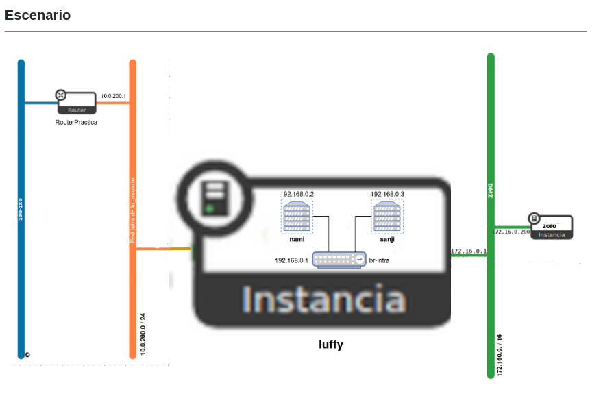
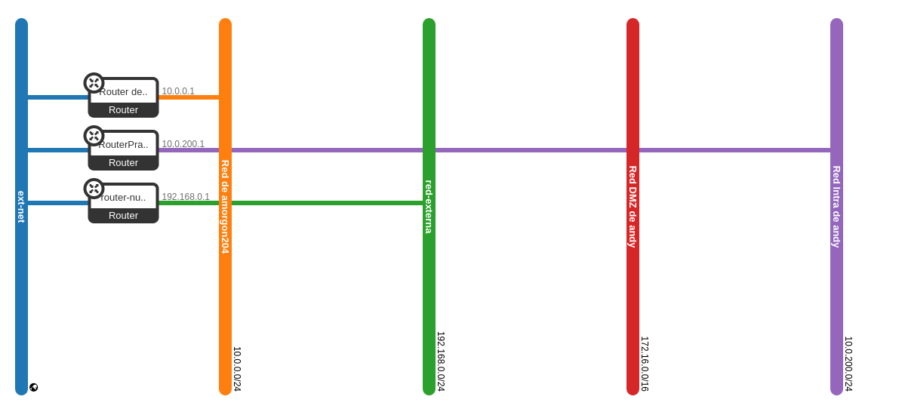

# Práctica (1 / 2): Escenario en OpenStack

En esta tarea se va a crear el escenario de trabajo que se va a usar durante todo el curso, que va a constar inicialmente de 4 máquinas: 2 instancias en OpenStack y dos contenedores LXC que se ejecutarán en una de las instancias.

Para nombrar las máquinas se van a utilizar los siguientes nombres: ***luffy, zoro, nami, sanji***. Estos nombres pertenecen la serie manga ***One Piece***.

Además el dominio será un subdominio de la forma ```tunombre.gonzalonazareno.org```. De esta forma tendremos:

- Máquina 1: Instancia en OpenStack con ***Debian 12 Bookworm*** que se llama ```luffy.tunombre.gonzalonazareno.org```.

- Máquina 2: Instancia en OpenStack con ***Rocky Linux 9*** que se llama ```zoro.tunombre.gonzalonazareno.org```.

- Máquina 3: Contenedor LXC con ***Ubuntu 22.04*** que se llama ```nami.tunombre.gonzalonazareno.org```.

- Máquina 4: Contenedor LXC con ***Ubuntu 22.04*** que se llama ```sanji.tunombre.gonzalonazareno.org```.

Todas las operaciones que realices sobre recursos de OpenStack lo tienes que hacer usando OSC.

## Escenario



## Creación de la infraestructura de red

* Crea un nuevo router llamado RouterPractica conectado a la red externa.

* Crea una red interna que se llame Red Intra de tu_usuario, con las siguientes características:

  - Está conectada al router que has creado en el punto anterior.

  - Direccionamiento: 10.0.200.0/24

  - Con DHCP y DNS (172.22.0.1).

  - La puerta de enlace de los dispositivos conectados a esta red será el 10.0.200.1.

* Crea una red interna que se llame Red DMZ de tu_usuario, con las siguientes características:

  - Direccionamiento: 172.16.0.0/16

  - Sin DHCP.

  - Deshabilitamos la puerta de enlace. Esto es para que cloud-init no configure la puerta de enlace en las instancias conectada a esta red.

  - La puerta de enlace de los dispositivos conectados a esta red será el 172.16.0.1.

### Paso a paso 

Lo primero que tenenmos que hacer es configurar el entorno de Openstack

```
madandy@toyota-hilux:~/Documentos/SegundoASIR/github/Servicios/uNIDAD4-openstack$ 
source Proyecto\ de\ amorgon204-openrc.sh 
Please enter your OpenStack Password for project Proyecto de amorgon204 as user amorgon204: 
```
2. Crearemos el Router 

- Primer paso es crear el router llamado ***RouterPractica*** con el siguiente comando:

```
openstack router create RouterPractica
```

Salida por pantalla:

```
madandy@toyota-hilux:~/Documentos/SegundoASIR/github/Servicios/uNIDAD4-openstack$ 
openstack router create RouterPractica
+-------------------------+--------------------------------------+
| Field                   | Value                                |
+-------------------------+--------------------------------------+
| admin_state_up          | UP                                   |
| availability_zone_hints |                                      |
| availability_zones      |                                      |
| created_at              | 2024-12-13T07:57:52Z                 |
| description             |                                      |
| enable_ndp_proxy        | None                                 |
| external_gateway_info   | null                                 |
| flavor_id               | None                                 |
| id                      | 300e978e-4766-4390-aeef-7b6f6ee2ccd5 |
| name                    | RouterPractica                       |
| project_id              | b336d672575846eab6d9b12320abc89b     |
| revision_number         | 1                                    |
| routes                  |                                      |
| status                  | ACTIVE                               |
| tags                    |                                      |
| tenant_id               | b336d672575846eab6d9b12320abc89b     |
| updated_at              | 2024-12-13T07:57:52Z                 |
+-------------------------+--------------------------------------+

```

2. Identificamos el nombre o ID de la red externa:

```
openstack network list

```
Nos sale esto por pantalla:

```
madandy@toyota-hilux:~/Documentos/SegundoASIR/github/Servicios/uNIDAD4-openstack$ 
openstack network list
+--------------------------------------+-------------------+--------------------------------------+
| ID                                   | Name              | Subnets                              |
+--------------------------------------+-------------------+--------------------------------------+
| 4ff6eee6-ef68-43f0-837d-1daee5963756 | Red de amorgon204 | 5b88b73c-32dd-4517-ba8b-f96ba38094e5 |
| 6d03efcd-e1c8-45fb-9381-eb3c1fb1ed9a | red-externa       | 03e25fa4-ae1c-415e-b221-ca9ba4f940a2 |
| 98d3f685-e398-43fa-812f-80c90371269d | ext-net           | ac19b62e-4454-467a-bfd3-1fb19693cf4c |
| ea54761e-5d08-4074-9bbf-7f97c029f3bd | red-interna       | fdeb76f2-8606-45c1-be97-70c1f65f40e7 |
+--------------------------------------+-------------------+--------------------------------------+

```

Y como hemos identificado la red externa en la salida anterior, la cual se llama ext-net, lo que haremos será conectarla al router:

```
openstack router set --external-gateway ext-net RouterPractica

```

Esto es lo que nos muestra por consola:

```
madandy@toyota-hilux:~/Documentos/SegundoASIR/github/Servicios/uNIDAD4-openstack$ 
openstack router set --external-gateway ext-net RouterPractica
```

3. Crear la red interna Red Intra de andrés

- Crear la red

```
openstack network create "Red Intra de andy"

```

Pantalal:

```
madandy@toyota-hilux:~/Documentos/SegundoASIR/github/Servicios/uNIDAD4-openstack$ 
openstack network create "Red Intra de andy"
+---------------------------+--------------------------------------+
| Field                     | Value                                |
+---------------------------+--------------------------------------+
| admin_state_up            | UP                                   |
| availability_zone_hints   |                                      |
| availability_zones        |                                      |
| created_at                | 2024-12-13T08:06:24Z                 |
| description               |                                      |
| dns_domain                | None                                 |
| id                        | d0b2523d-62ae-4b1e-acf0-4325481a9cda |
| ipv4_address_scope        | None                                 |
| ipv6_address_scope        | None                                 |
| is_default                | False                                |
| is_vlan_transparent       | None                                 |
| mtu                       | 1442                                 |
| name                      | Red Intra de andy                    |
| port_security_enabled     | True                                 |
| project_id                | b336d672575846eab6d9b12320abc89b     |
| provider:network_type     | None                                 |
| provider:physical_network | None                                 |
| provider:segmentation_id  | None                                 |
| qos_policy_id             | None                                 |
| revision_number           | 1                                    |
| router:external           | Internal                             |
| segments                  | None                                 |
| shared                    | False                                |
| status                    | ACTIVE                               |
| subnets                   |                                      |
| tags                      |                                      |
| updated_at                | 2024-12-13T08:06:25Z                 |
+---------------------------+--------------------------------------+

```

- Crear la subred

Crea una subred con el direccionamiento 10.0.200.0/24, habilita DHCP y especifica el DNS 172.22.0.1. La puerta de enlace será 10.0.200.1:

```
openstack subnet create "Subnet Red Intra de andy" \
  --network "Red Intra de andy" \
  --subnet-range 10.0.200.0/24 \
  --dns-nameserver 172.22.0.1 \
  --gateway 10.0.200.1 \
  --dhcp

```

Por pantalla:

```
madandy@toyota-hilux:~/Documentos/SegundoASIR/github/Servicios/uNIDAD4-openstack$ 
openstack subnet create "Subnet Red Intra de andy" \
  --network "Red Intra de andy" \
  --subnet-range 10.0.200.0/24 \
  --dns-nameserver 172.22.0.1 \
  --gateway 10.0.200.1 \
  --dhcp
+----------------------+--------------------------------------+
| Field                | Value                                |
+----------------------+--------------------------------------+
| allocation_pools     | 10.0.200.2-10.0.200.254              |
| cidr                 | 10.0.200.0/24                        |
| created_at           | 2024-12-13T08:07:51Z                 |
| description          |                                      |
| dns_nameservers      | 172.22.0.1                           |
| dns_publish_fixed_ip | None                                 |
| enable_dhcp          | True                                 |
| gateway_ip           | 10.0.200.1                           |
| host_routes          |                                      |
| id                   | 53e24be9-ee9b-441b-9249-7cbf604c7c68 |
| ip_version           | 4                                    |
| ipv6_address_mode    | None                                 |
| ipv6_ra_mode         | None                                 |
| name                 | Subnet Red Intra de andy             |
| network_id           | d0b2523d-62ae-4b1e-acf0-4325481a9cda |
| project_id           | b336d672575846eab6d9b12320abc89b     |
| revision_number      | 0                                    |
| segment_id           | None                                 |
| service_types        |                                      |
| subnetpool_id        | None                                 |
| tags                 |                                      |
| updated_at           | 2024-12-13T08:07:51Z                 |
+----------------------+--------------------------------------+

```

- Conectar la red al router

Asociar esta subred al router RouterPractica:

```
openstack router add subnet RouterPractica "Subnet Red Intra de andy"
```

Por pantalla:

```
madandy@toyota-hilux:~/Documentos/SegundoASIR/github/Servicios/uNIDAD4-openstack$ 
openstack router add subnet RouterPractica "Subnet Red Intra de andy"
```

4. Crear la red interna ```Red DMZ de andy```

- Crear la red

```openstack network create "Red DMZ de andy"
```

Por pantalla:

```
madandy@toyota-hilux:~/Documentos/SegundoASIR/github/Servicios/uNIDAD4-openstack$ 
openstack network create "Red DMZ de andy"
+---------------------------+--------------------------------------+
| Field                     | Value                                |
+---------------------------+--------------------------------------+
| admin_state_up            | UP                                   |
| availability_zone_hints   |                                      |
| availability_zones        |                                      |
| created_at                | 2024-12-13T08:10:16Z                 |
| description               |                                      |
| dns_domain                | None                                 |
| id                        | 8352b660-9324-4e35-8da8-9c69dabd46e7 |
| ipv4_address_scope        | None                                 |
| ipv6_address_scope        | None                                 |
| is_default                | False                                |
| is_vlan_transparent       | None                                 |
| mtu                       | 1442                                 |
| name                      | Red DMZ de andy                      |
| port_security_enabled     | True                                 |
| project_id                | b336d672575846eab6d9b12320abc89b     |
| provider:network_type     | None                                 |
| provider:physical_network | None                                 |
| provider:segmentation_id  | None                                 |
| qos_policy_id             | None                                 |
| revision_number           | 1                                    |
| router:external           | Internal                             |
| segments                  | None                                 |
| shared                    | False                                |
| status                    | ACTIVE                               |
| subnets                   |                                      |
| tags                      |                                      |
| updated_at                | 2024-12-13T08:10:16Z                 |
+---------------------------+--------------------------------------+
```

- Crear la subred

En este caso, deshabilitaremos DHCP y no configuraremos una puerta de enlace:

```
openstack subnet create "Subnet Red DMZ de andy" \
  --network "Red DMZ de andy" \
  --subnet-range 172.16.0.0/16 \
  --no-dhcp \
  --gateway none
```

Por pantalla:

```
madandy@toyota-hilux:~/Documentos/SegundoASIR/github/Servicios/uNIDAD4-openstack$ 
openstack subnet create "Subnet Red DMZ de andy" \
  --network "Red DMZ de andy" \
  --subnet-range 172.16.0.0/16 \
  --no-dhcp \
  --gateway none
+----------------------+--------------------------------------+
| Field                | Value                                |
+----------------------+--------------------------------------+
| allocation_pools     | 172.16.0.1-172.16.255.254            |
| cidr                 | 172.16.0.0/16                        |
| created_at           | 2024-12-13T08:12:44Z                 |
| description          |                                      |
| dns_nameservers      |                                      |
| dns_publish_fixed_ip | None                                 |
| enable_dhcp          | False                                |
| gateway_ip           | None                                 |
| host_routes          |                                      |
| id                   | a2af2d77-84e5-463a-806d-7980694d4f53 |
| ip_version           | 4                                    |
| ipv6_address_mode    | None                                 |
| ipv6_ra_mode         | None                                 |
| name                 | Subnet Red DMZ de andy               |
| network_id           | 8352b660-9324-4e35-8da8-9c69dabd46e7 |
| project_id           | b336d672575846eab6d9b12320abc89b     |
| revision_number      | 0                                    |
| segment_id           | None                                 |
| service_types        |                                      |
| subnetpool_id        | None                                 |
| tags                 |                                      |
| updated_at           | 2024-12-13T08:12:44Z                 |
+----------------------+--------------------------------------+
```

>Deshabilitar la puerta de enlace evita que cloud-init configure automáticamente una puerta de enlace para las instancias conectadas a esta red. Esto es útil para configuraciones de redes específicas como DMZ.

5. Verifiacmos la configuración

- Listar redes
Comando: ```openstack network list```
```
madandy@toyota-hilux:~/Documentos/SegundoASIR/github/Servicios/uNIDAD4-openstack$ 
openstack network list
+--------------------------------------+-------------------+--------------------------------------+
| ID                                   | Name              | Subnets                              |
+--------------------------------------+-------------------+--------------------------------------+
| 4ff6eee6-ef68-43f0-837d-1daee5963756 | Red de amorgon204 | 5b88b73c-32dd-4517-ba8b-f96ba38094e5 |
| 6d03efcd-e1c8-45fb-9381-eb3c1fb1ed9a | red-externa       | 03e25fa4-ae1c-415e-b221-ca9ba4f940a2 |
| 8352b660-9324-4e35-8da8-9c69dabd46e7 | Red DMZ de andy   | a2af2d77-84e5-463a-806d-7980694d4f53 |
| 98d3f685-e398-43fa-812f-80c90371269d | ext-net           | ac19b62e-4454-467a-bfd3-1fb19693cf4c |
| d0b2523d-62ae-4b1e-acf0-4325481a9cda | Red Intra de andy | 53e24be9-ee9b-441b-9249-7cbf604c7c68 |
| ea54761e-5d08-4074-9bbf-7f97c029f3bd | red-interna       | fdeb76f2-8606-45c1-be97-70c1f65f40e7 |
+--------------------------------------+-------------------+--------------------------------------+

```
- Listar subredes 
COmando ```openstack subnet list```

```
madandy@toyota-hilux:~/Documentos/SegundoASIR/github/Servicios/uNIDAD4-openstack$ 
openstack subnet list
+--------------------------------------+--------------------------+--------------------------------------+----------------+
| ID                                   | Name                     | Network                              | Subnet         |
+--------------------------------------+--------------------------+--------------------------------------+----------------+
| 03e25fa4-ae1c-415e-b221-ca9ba4f940a2 | red-externa-subnet       | 6d03efcd-e1c8-45fb-9381-eb3c1fb1ed9a | 192.168.0.0/24 |
| 53e24be9-ee9b-441b-9249-7cbf604c7c68 | Subnet Red Intra de andy | d0b2523d-62ae-4b1e-acf0-4325481a9cda | 10.0.200.0/24  |
| 5b88b73c-32dd-4517-ba8b-f96ba38094e5 | subnet_amorgon204        | 4ff6eee6-ef68-43f0-837d-1daee5963756 | 10.0.0.0/24    |
| a2af2d77-84e5-463a-806d-7980694d4f53 | Subnet Red DMZ de andy   | 8352b660-9324-4e35-8da8-9c69dabd46e7 | 172.16.0.0/16  |
| fdeb76f2-8606-45c1-be97-70c1f65f40e7 | red-interna-subnet       | ea54761e-5d08-4074-9bbf-7f97c029f3bd | 10.0.100.0/24  |
+--------------------------------------+--------------------------+--------------------------------------+----------------+
```
- Router configuración

Comando ```openstack router show RouterPractica```

```
madandy@toyota-hilux:~/Documentos/SegundoASIR/github/Servicios/uNIDAD4-openstack$ 
openstack router show RouterPractica
+-------------------------+--------------------------------------------------------------------------------------------------------------------------------------------------------------------------------------------+
| Field                   | Value                                                                                                                                                                                      |
+-------------------------+--------------------------------------------------------------------------------------------------------------------------------------------------------------------------------------------+
| admin_state_up          | UP                                                                                                                                                                                         |
| availability_zone_hints |                                                                                                                                                                                            |
| availability_zones      |                                                                                                                                                                                            |
| created_at              | 2024-12-13T07:57:52Z                                                                                                                                                                       |
| description             |                                                                                                                                                                                            |
| enable_ndp_proxy        | None                                                                                                                                                                                       |
| external_gateway_info   | {"network_id": "98d3f685-e398-43fa-812f-80c90371269d", "external_fixed_ips": [{"subnet_id": "ac19b62e-4454-467a-bfd3-1fb19693cf4c", "ip_address": "172.22.200.113"}], "enable_snat": true} |
| flavor_id               | None                                                                                                                                                                                       |
| id                      | 300e978e-4766-4390-aeef-7b6f6ee2ccd5                                                                                                                                                       |
| interfaces_info         | [{"port_id": "faea11f8-6c72-4d33-a071-c2e76440d6f6", "ip_address": "10.0.200.1", "subnet_id": "53e24be9-ee9b-441b-9249-7cbf604c7c68"}]                                                     |
| name                    | RouterPractica                                                                                                                                                                             |
| project_id              | b336d672575846eab6d9b12320abc89b                                                                                                                                                           |
| revision_number         | 3                                                                                                                                                                                          |
| routes                  |                                                                                                                                                                                            |
| status                  | ACTIVE                                                                                                                                                                                     |
| tags                    |                                                                                                                                                                                            |
| tenant_id               | b336d672575846eab6d9b12320abc89b                                                                                                                                                           |
| updated_at              | 2024-12-13T08:09:02Z                                                                                                                                                                       |
+-------------------------+--------------------------------------------------------------------------------------------------------------------------------------------------------------------------------------------+

```



## Instalación de las instancias de OpenStack

### Configuración de las instancias

Las dos instancias que vamos a crear se van a configurar con cloud-init de la siguiente manera:

- Deben actualizar los paquetes de la distribución de la instancia.

- El dominio utilizado será del tipo tunombre.gonzalonazareno.org. Por lo tanto en la configuración con cloud-init habrá que indicar el hostname y el FQDN.

- Se crearán dos usuarios:

  - Un usuario sin privilegios. Se puede llamar como quieras (pero el nombre será el mismo en todas las máquinas) y accederás a las máquinas usando tu clave ssh privada.

  - Un usuario profesor, que puede utilizar sudo sin contraseña. Copia de las claves públicas de todos los profesores en las instancias para que puedan acceder con el usuario profesor.

- Cambia la contraseña al usuario root.

### Creación de las instancias

#### máquina1 (luffy)

- Crea una instancia sobre un volumen de 15Gb (el volumen se crea durante la creación de la instancia), usando una imagen de Debian 12 Bookworm. Elige el sabor vol.medium. Y configuralá con cloud-init como se ha indicado anteriormente.

- Está instancia estará conectada a las dos redes. Recuerda que en la red Red DMZ debe tomar la dirección 172.16.0.1 (puerta de enlace las máquinas conectadas a esta red). Asigna a la instancia una IP flotante.

- Deshabilita la seguridad de los puertos en las dos interfaces de red para que funcione de manera adecuada el NAT.
- Configura de forma permanente la regla SNAT para que las máquinas de la Red DMZ tengan acceso a internet.

#### maquina2 (zoro)

- Crea un volumen de 15Gb con la imagen Rocky Linux 9.

- Crea la instancia a partir de este volumen. Elige el sabor vol.medium. Y configúrala con cloud-init como se ha indicado anteriormente.

- En un primer momento, para que la instancia se configure mediante cloud-init conecta esta instancia a un red con DHCP.

- Posteriormente, desconecta la interfaz de red de esa red y conéctala a la red Red DMZ a la dirección 172.16.0.200.

- Recuerda, que esa configuración no se hará de forma automática por lo que deberas, de forma manual, configurar la red en esta máquina. recuerda que Rocky Linux tiene instalado por defecto NetwokManager.

- Deshabilita la seguridad de los puertos en la interfaz de red para que funcione de manera adecuada el NAT.

- Comprueba que tiene acceso a internet.

### Paso a paso 

1. Crear la instancia ```luffy.andy.gonzalonazareno.org```

- Crear el volumen para la instancia

```
openstack volume create --size 15 --image "Debian 12 Bookworm" luffy-volume
```

- Crear la instancia conectada a las redes

